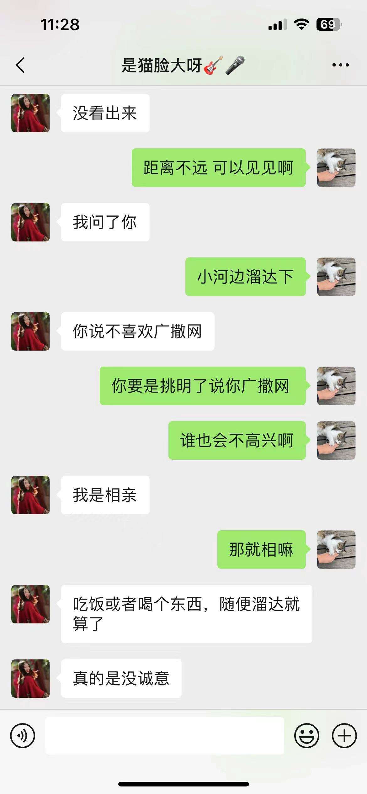
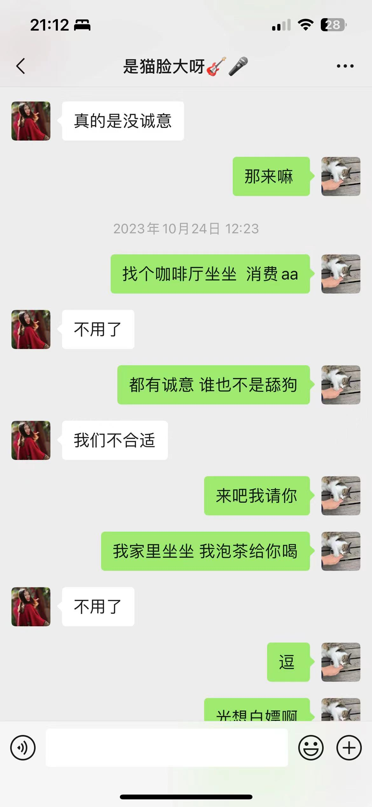
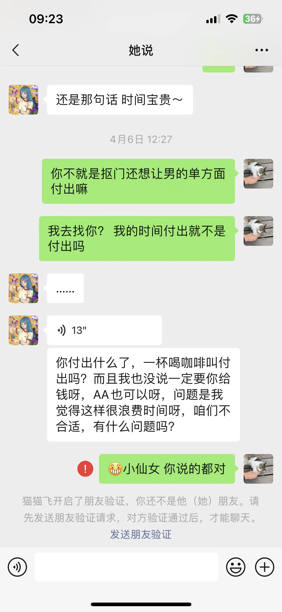

# 相亲女综述and筛选思路

其实大多数男女，都绕不开各种交友软件，探探这种约炮软件普通长相的人玩不了，而类似牵手、青藤这种软件，上面既有想单纯谈恋爱的，也有找结婚对象的，这里统称相亲软件。

请给自己的颜值打分，参考标准： [#yan-zhi-da-fen-can-kao-biao-zhun](../yi-ge-can-ku-de-shi-shi/sub0.md#yan-zhi-da-fen-can-kao-biao-zhun "mention")

> 不要在自己的劣势领域，不停栽跟头，那跟傻努力是一样的。
>
> 长相一般的男的，女的跟你聊天都会说想要长期关系，奔结婚去的。
>
> 她总不能跟你说她喜欢帅的吧？

长相一般的男的，玩相亲软件效率高一点（搭讪其实挺累的），包装人设只是第一步，后续还会有很多困难要克服。

笔者玩的相亲软件（2022年）：牵手app、marryU、青藤、她说、珍爱网、summer。

笔者身高173，颜值一般（鼻子塌、脸方，还有点偏颌），自评4.5分，在相亲软件上，能最终跟我聊天有来有回的，大概率是4\~6分的妹子，偶尔有7分的。这里的7分指的是衣品+身材，综合起来比较带劲儿的。

笔者现在是相亲软件为主，搭讪为辅。\
而且相亲软件玩多了，经验都能运用到搭讪加的妹子上，差别不大，

本节内容，均是笔者玩了一段相亲软件之后的经验之谈，欢迎联系我探讨。

\[TOC]

## 一切痛苦来源于帅哥vs美女的数量失衡

这个前文提过，我再强调一次。

女的一直在卷外在，男的一直被社会pua而不那么注重外在。势必造成美女多帅哥少。

女人20岁的时候月薪3000,40岁的时候月薪可能还是3000，她对此不会有什么心理负担，但是哦她多年攒的钱拿来做医美项目的时候可是一点都不吝啬。

很多女人能卷外在从17岁卷到40岁，男的呢？

这个帅哥美女的数量差值是巨大的，你想想，中国14亿人，7亿女人都知道卷外在，7亿男的都不那么注意外在，这最终导致的帅哥美女的数量差值，可想而知。

但是社会财富增加，女人日子过得好了，能吃得饱饭租得起房子，为什么不找个好看点的男的谈恋爱呢？

你一年交税10W，她一年交税1w，但是哦，你们坐飞机高铁地铁都是一个价格，你们用的医保报销也是无差别，这给女人造成了一种错觉『我经济独立了，我想追求美好的爱情（跟帅哥打炮）』

你年薪50万，可是你不怎么好看，女人还是对你提不起兴趣，但是站在她的角度，总不能一直被帅哥短择吧？帅哥连饭都不舍得请她吃，更别提带她旅游给她买礼物。(帅哥极度稀缺)

换句话说，社会上所有女人的 生理需求+情感需求，需要数量x的帅哥去满足，但是已存在的帅哥的数量远小于x，这就使得丑男的所谓『靠 技巧+有钱就能有妹子』的算法 ，有了可博弈的空间。

你牢记『一切痛苦来源于帅哥vs美女的数量失衡』这个真理，那么妹子对你各种态度行为，你都能合理解释了。

> 如果一个女的又是健身又是整容，那么她的人生走向有3种：
>
> 1. 越整容越上瘾（有正反馈），觉得大多数男的配不上她，在被帅哥短择、被有钱人戏耍之间反复横跳，最终心灰意冷，发出了『女人还是要靠自己』的感慨，决定未婚生子，以孩子为人生寄托，努力工作，永远不结婚。（体制内的女性，这样做的概率更高，因为永远饿不死）
> 2. 运气好找到了一个大供养者，拿到长期饭票。当然了，要演技足够好（会攻心），脸整得足够漂亮。
> 3. 脸整得不够漂亮，或者演技也不行，又或者她没钓到大供养者（有钱人毕竟是少数），最终认清了现实，并且愿意放低姿态，她找了一个小供养者厮守终身。

### 案例1

聊天截图+分析

此女来自牵手app，年龄31岁，职业是大学老师。

别看女人说什么，女人普遍口是心非。

此女的真实想法是：

**因为看不上你的外在，所以对你特别理性，在鸡毛蒜皮的细节上，对你高要求。比如你没有及时回复、回复的某个话语她不满意。总之就是对你容忍度低。**

还有，如果一个女的跟你说男人外在不重要，她的真实想法是，她觉得你长得不咋地，与其花费精力金钱去卷外在，不如当好一个供养者。『你这个丑男，你还想变帅？你触犯我的利益了』

你变不变得成帅哥，未可知也，但是我肉眼可见的，我少了一个潜在供养者，我不爽了。

靠变美来获取利益，这本来是我的套路打法，你怎么也用？本仙女不爽了

虽然她看不上你的外在，但是她还是会跟你聊很多，邀约你，向你表露接触的意愿。

这是因为她微信列表里，她觉得分数达标的帅哥，那几个帅哥要么不怎么屌她，要么只愿意跟她约炮。

『跟王子打过炮，所以认为自己是公主』，她的榆木脑袋，导致她想不明白这个道理。

她只是凭着动物本能，指导自己的行为，对帅哥和非帅哥区别对待。

这个女孩，因为职业是老师（生活环境简单），结合她的之前发言，我猜测她给我发那些很傻逼的话的时候，她自己是真的相信的，坏or蠢二选一，我觉得她只是蠢而已。\
比如我如果聊天围着她转，是可能打动她的。她可能跟男的短择过，但不妨碍她心态还处在『良家女』这个阶段。

## 我在软件上的匹配情况

我吹自己北京成都有房，清华硕士，年薪50W。我的颜值前文已表述。

展示面，我拍的一些高档酒店、环境好的餐厅，尽量让外人看起来生活精致、家境好。

我看重女人身材，脸一般就行，但是我匹配到的身材火辣的妹子，还是屈指可数

这说明这个时代，稍微有点姿色的女人，都是把男人的颜值身高身材放在第一位的，这意味着，供养者更难泡妞了。比如说你长相5分男，那么你可能需要年薪100W，才能大量匹配到7分女，而且相处过程中还可能被女的百般刁难。

相关阅读： [sub1.md](../yi-ge-can-ku-de-shi-shi/sub1.md "mention")

## 不妨把剩女标签化

把人标签化是为了我们更方便地生活，避免被傻逼浪费时间。

剩女之所以剩下，就是因为她在一次次的异性交往里，展露了奇葩属性，让男人敬而远之。

下面几个**相亲软件女的行为**，都是我微信的真实案例。

* 女1，33岁，来自marryU，身材火辣。加微信聊了几句，嫌我不够热情把我删了，我加回来，她说『你都不怎么跟我说话，白天你应该及时回复我』（其实是嫌我丑，所以对我容忍度低。她觉得我应该舔她，围着她转），还有微信一言不合就直接甩脸子，不赘言。
* 女2，32岁，来自牵手app。微信没聊几句，说不想干聊，想见面，即使是在我已经给她发我形象视频的情况下。（可能是不屑于跟我微信培养熟悉感，想见面看我实力，顺便广撒网）
*   女3，38岁，来自牵手app。初次见面我通勤过去她小区，位置是小区楼下茶馆，我到了她才懒洋洋步行过来，茶馆结束到付账时，我以为她理所当然付账的，毕竟她挑的地方我通勤找她。

    我故意在后面，她在前面，我就等着她付账。但是这女的扭个头对我说『来咱把账结了吧』。我就内心几头草泥马。

    后来微信聊天，我找机会说『咋了，要请哥哥吃饭嘛』，女的立马发飙，说我软饭男。（其实是嫌我丑，觉得我就该单向付出金钱）
* 女4--30岁、女5--27岁，来自牵手app。这两个案例，我没提前给她发我形象视频，女的也是微信上说不想聊天想见面，然后见了面然后跟我说她颜控。我都被气笑了，长啥样啊，就说自己颜控？有了这样的经历，我从交友软件转移到微信以后，一定会给女的发形象视频，打预防针，筛选。
* 女6--28岁。微信铺垫了一段时间，某一天我提出邀约，她说下班了比较累，让我找她，我当时坚持要距离折中。她开始发飙，说『因为是你约的我，所以当然是你来找我』
*   女8--27岁，来自青藤。

    * 1.略有姿色，骨架大。
    * 2.聊天直女，但是真诚，对我有窗口。
    * 3.见面后表现尚可，分别时我要求拥抱，被拒绝
    * 4.回家后主动给我打语音，之后微信断断续续聊天，但是直女不会表达好感，所以也就到不了暧昧（细节1：聊天上突然来一句『想我那你来找我吧』）
    * 5 若干天后，说我们不合适，指责我不够主动（你为什么不舔我）

    总结，奇葩女，不懂得怎么跟一个男人从陌生到暧昧到恋爱，被主流价值观洗脑，放不开去表达好感。 但是又天真地觉得别人理应主动，否则就是不在乎自己。 而且 还比较自信，喜欢规训男人。

## 宇宙级难题

对我而言，每个相亲软件/交友app上面的妹子，都能简单归结成下述问题

1. 已知对方姿色一般但不丑，自称恋爱经历不多，但是背地里可能被短择n次。
2. 对方对你有一定窗口
3. 对方对恋爱可能有各种奇葩的诉求，不按常理出牌，脑回路让人费解。
4. 你约她能约出来

已知上述几条，现在，我们如何在花费最少的时间+金钱的情况下，把对方睡了/长期打炮/筛选出比较有戏的妹子。

一想到要不停跟奇葩过招，随时面对时间精力的白白损耗，就比较焦虑

## 相亲女的分类

更新于2024-04-17

> _我发现作斗争时，对敌人进行分类，突然就豁然开朗了。所谓用最小的代价获得胜利。_
>
> _把一件事通俗易懂、让人印象深刻地阐述，真的不容易。_
>
> 今天突然地领悟到，每次新接触一个女人，把她分好类，能大概率提高把妹效率。

我只以我自己的长相为参考基线来讨论，因为目前我的人设是中产家庭，不是有钱人，所以在女人眼里，我的长相是她一切逻辑算法的决定因素。

_**类别1：小于等于我的分数的。**_\
又分两类：

1、 眼光高的

俗称人丑颜控，需要你价值硬或者肯跪舔的，不建议接触。

这种妹子的内心想法和对待我的各种态度，跟类别2.1、2.2（给你一个追我的机会、会有一定程度的主动.）情况一样。

这种妹子，内心可能笃定了要广撒网。

跟王子打过炮，认为自己是公主，你所知道的各种剩女的心理，这种妹子都可能有。\
这种妹子遇到过几次，你就能感觉到，**他对你的要求极高**，一条不符合都不行，但是她私下里逼有没有闲着，你就不知道了。

这种妹子里面有一些典型特点值得说一下：

> 朋友圈照片不多，不喜欢自拍，不健身不练屁股。
>
> 颜值不高，但是也不丑，见了面你会发现妹子穿搭看起来其实也不错。
>
> 聊天不暧昧，一直跟你唠家常，说自己矜持放不开，又或者说自己不喜欢聊天，想先见面。
>
> 比如30岁了，声称自己是处女，没谈过恋爱。（笔者遇到2次）
>
> 比如说自己只谈过一次，然后自己单身很多年了。（笔者遇到过一次说5年+、一次6年的）
>
> 见完面，通常会随随便便挑你一个毛病，然后说不合适。
>
> 『不管怎样，我一定要遇到一个让我心动的男生，如果没那种感觉，我愿意一直这样重复，见软件上一个又一个男的，一直单身下去我也无所谓』

2、 眼光低的\
眼光低的是我的目标，这种妹子需要走心，而且花的钱也不用很多，你多跟她拉扯一下，搞定的难度其实不高。\
这种妹子，她脱单挺容易的，她内心是不喜欢广撒网的。接触下来你能感受到妹子内心是比较单纯善良的。

未见面，前期聊天时候，这种妹子有两种类型：

* 愿意跟你暧昧调情。那么大概率第一次见面你们就能拥抱、接吻。
* 不愿意暧昧。见面后，唠家常，回去了，微信上她会跟你继续接触。

这种妹子可能有各种奇葩之处，你要宽容她，哄着她。

_**类别2：比我分数高的。**_

这种妹子其实没有一个是容易搞的，参考一下 [#nv-ren-dui-gong-yang-zhe-de-san-zhong-tai-du](../yi-ge-can-ku-de-shi-shi/sub1.md#nv-ren-dui-gong-yang-zhe-de-san-zhong-tai-du "mention") 里面的内容

但是吧，不搞比自己分高的妹子，那不就是没梦想吗！所以依然值得去接触

1. 第一种态度：给你一个追我的机会。
   * 这种pass掉，聊天大概率就跟死鱼一样，会回复你，但是姿态比较高。又或者，张嘴就是让你请吃饭的。
   * 接触妹子多了你其实本能地会躲开这种妹子，所以排除起来也没什么难度。交友软件上匹配完聊几句就感觉到了，微信都没有必要加。
   * 这种妹子之所以态度这么叼，是因为巨大的的饥渴丑男基数，使得她即使态度叼也能收获不少舔狗。
   * 跪舔也许能打动她，但是对我们pua玩家来说，机会成本太高了，我们不能把生杀予夺的主动权交到别人手里，因为她对你容忍度很低。
2. 第二种态度，会有一定程度的主动.。但是吧细分来说，还分好几种。这里我列出比较典型的3种。
   1. <mark style="color:red;">**长期聊天唠家常，但是绝不暧昧。**</mark>\
      典型案例在 [#an-li-si-cheng-ren-zi-ji-guang-sa-wang-de-xiang-qin-nv](dian-xing-xiang-qin-nv-an-li.md#an-li-si-cheng-ren-zi-ji-guang-sa-wang-de-xiang-qin-nv "mention") ，这种妹子也不在少数，她认为，『我都跟你唠家常了，打那么多字，我还不够主动么』，\
      但是你的暧昧试探她不会接茬，她会说矜持慢热。这就比较呵呵了，千万别信。不跟你暧昧是因为觉得你不配，她本能地抗拒。\
      这种妹子内心『大概率』是把广撒网当基本操作的，你可以接触，但是要引导她付出。\
      参考阅读 [#xiang-qin-nv-mei-zen-me-liao-jiu-zhu-dong-yao-yue-ni](guan-yu-xiang-qin-nv.md#xiang-qin-nv-mei-zen-me-liao-jiu-zhu-dong-yao-yue-ni "mention")
   2. <mark style="color:red;">**她说不喜欢聊天，但会直接邀约你。**</mark>\
      内心活动是：你看你长那样，不知道照照镜子？我都邀约你了，我还不算主动么\
      参考阅读 [#xiang-qin-nv-mei-zen-me-liao-jiu-zhu-dong-yao-yue-ni](guan-yu-xiang-qin-nv.md#xiang-qin-nv-mei-zen-me-liao-jiu-zhu-dong-yao-yue-ni "mention")
   3. <mark style="color:red;">**聊天随口给你希望、表达好感，然后还会邀约你**</mark>\
      典型案例在 [#an-li-er-sui-yi-yao-yue-wo-de-35-sui-da-ling-nv](dian-xing-xiang-qin-nv-an-li.md#an-li-er-sui-yi-yao-yue-wo-de-35-sui-da-ling-nv "mention")\
      这个案例非常典型，这女的有些迷惑性，女的会口头上给我希望，比如说是我喜欢的类型，但是聊天过程中我能感受到对方的投入度有限。约会时候也能感受到，但是奇葩的是这女的还多次约我（因为住得近）。\
      \
      还有一种典型的女的，如果你人设牛逼，或者你真的是社会精英，有的女的会把你当人脉经营，这种就比较搞笑了。\
      站在男人的角度，跟一个只有长相、没脑子的人处人脉是浪费时间。\
      站在女人的角度，觉得自己有姿色，然后觉得一般长相男的配不上自己，然后觉得自己要么找帅哥打炮，要么得找点成功人士社交（看能不能遇到个跪舔的），变现点好处（金钱or软性的收益）。 典型案例 ：\
      [#an-li-san-xiang-qin-nv-xiang-jing-ying-ren-mai](dian-xing-xiang-qin-nv-an-li.md#an-li-san-xiang-qin-nv-xiang-jing-ying-ren-mai "mention")\
      这种妹子说实话也不建议接触，实在无聊了可以试着接触下，但是一定要控制时间和金钱成本
3. 第三种态度， 假装把你当情人，但是她心里怎么想的你不知道
   * 这种小概率会遇到，如果你人设包装得很有钱or高知识分子or潜力股，你会发现有些美女跟你走心说对你是真爱啊，如果遇到这种妹子，那么我们就需要打起十二分精神，步步为营；
   * 这种妹子也分两种，很会攻心的和中规中矩的。很会攻心的妹子大概率比较抠门，因为她用这种方法捞过很多男人的钱，所以相处的时候要引导她付出金钱。
   * [#an-li-1-mou-yu-ga-jiao-lian](xin-ji-biao-an-li.md#an-li-1-mou-yu-ga-jiao-lian "mention")
   * 看一下案例，这个瑜伽教练比较经典，用走心交流、大方表达好感来唤起男人内心对真挚情感的渴望。需要警惕的是，经验少的男人容易动心，然后疯狂给女的花钱。
   * 不过这个瑜伽教练是属于非常会提供情绪价值的情况，类比一下，男模是怎么捞富婆的钱的。

## 相亲女的极端情况

_**极端差的情况：**_

1. 我长得挺不错的，但是探探上那些帅哥都不怎么搭理我，或者只跟我打炮，我来玩相亲软件找个经济适用男，应该能降维打击吧
2. 我比较慢热，他得主动点，起码请我10顿饭，带我旅旅游吧
3. 初次见面和以后的每次见面，男的通勤20km来我这边找我，请我吃饭，理所应该的。
4. 广撒网是正常的，得见100个男的，挑选对我最好的最舍得花钱的（颜值身高必须过关），重点培养。反正每次面基我又不用花钱
5. 我是女孩子，男方最好像保姆一样哄着我，顺着我。
6. 我有认识的闺蜜，把对象调教得服服帖帖的，唯唯诺诺的提款机，我也想要一个。
7. 不想被白嫖，我才没那么容易被睡到， 他得给我花点钱才行。

## 相亲女没怎么聊就主动邀约你？

指的是初次见面。

这里的『没怎么聊』，指的是『聊天没几句』或者『聊天只是断断续续的唠家常』

这个问题非常头痛，因为**女人的时间是不值钱的**。低学历、低圈层的女性尤为严重

对笔者来说，『软件上刚匹配，聊了不到10句女的就提出要见面』，遇到这种情况，对方女的分数通常比我高很多。

跟一个不靠谱的相亲女 微信聊天2小时，见面前收拾1小时，通勤+见面1小时，这4个小时拿来干啥不好呢。

但是这个问题又十分关键，因为我们要避免傻逼浪费我们宝贵的时间。

『女方随意邀约』我遇到很多，这种女的连聊天+调情的时间都不愿意花费，非坏即蠢。

我都被搞的有心理阴影了，见面了才发现对面是傻逼，心疼自己浪费了很多时间，而这个傻逼女的，我本来可以在聊天阶段就筛选掉的。

1. 坏：单纯广撒网的，pass掉。（对方大概率分数比你高）
2.  蠢：那么她未必坏，可能只是经历少而已，你可以见她。但是要低成本。

    参考 [#dui-xiang-qin-nv-de-shai-xuan-si-lu](guan-yu-xiang-qin-nv.md#dui-xiang-qin-nv-de-shai-xuan-si-lu "mention")

### 解读女人的广撒网心态

20240105某网友发言：

> 我告诉你为什么，因为一个女生能够一天见一个，一个礼拜见5个男的
>
> 他们见面并没有我们想那样要慎重，很喜欢才见面
>
> 他们见面就跟。健身房办卡一样，随便拉一个人就会游泳健身了解一下

在这里我会比较啰嗦，因为我发现，对每个人来讲，很多简洁的道理，需要被现实教育得头破血流，才会真的当回事，从而指导自己的生活。比如低调、谨慎，比如身体健康才是第一位的，比如不跟人争论，比如认识到人就是分三六九等的，比如学会无视别人对自己的否定，比如认识到『唯女子与小人难养也』。

而且，现在网络上信息爆炸，真正有价值的信息分两类：\
1.告诉你你不知道的，即补全信息差\
2.把一句话的道理/大家耳熟能详的道理，阐述明白（举例证明、讲原因、探究本质）

二点尤其重要，就好比农村的父母只会告诉你『好好学习』『早睡早起』，这就成毒鸡汤了，一点作用没有。

所以我把一个简单的结论掰开了揉碎，反复地强调，又是举例说明，又是讲一些很通用的道理去佐证这个泡妞技巧，就是为了让你上心。

我不希望读者跟我一样约会了好多相亲女才意识到哎呀好像不对劲儿，我希望你看完我的文字，花费更少的时间精力实战完，又跑到这里看我写的文字，然后一拍大腿说原来我跟作者是有共鸣的，谢谢作者让我少走弯路了。

接下来我需要你上心的一句结论是：**女人喜欢广撒网而男人不喜欢广撒网。**



贴一个知乎链接，上面很多男性回答在阐述女人的广撒网问题。你可以去找找共鸣。

摘录一个回答里面的内容：

> 女性的择偶策略是通过大范围的接触异性，建立自己的mating list，然后在里面筛选一个综合价值最高的。简单来讲就是大范围的养备胎，然后挑一个最优秀的，有相亲经验的应该都明白，没几个女生相亲只相一个。

意识到男女思维的差异非常重要。

女的想的是：

> 我这么仙气飘飘可得好好挑选一下，虽然我只有5分，但是我跟7分男打过炮，并且只要我肯努力广撒网，我仍然时不时能约到一个7分男打炮。
>
> 参考阅读： [#nannxing-yu-qiang-ruo-bu-tong](jian-mian-ji-ci-ke-yi-da-pao.md#nannxing-yu-qiang-ruo-bu-tong "mention")
>
> [wei-shen-me-chounye-kan-bu-shang-ni.md](../er-guan-yu-nv-ren/wei-shen-me-chounye-kan-bu-shang-ni.md "mention")
>
> 打过炮=我配的上他。
>
> 所以在我眼里，低于7分的男的，我其实是看不上的，但是7分男太少了，我得靠运气才能时不时睡到。 所以我才需要对低于7分的男的广撒网，找到一个我满意的长期交往。（金钱投入、情绪价值（跪舔和嘘寒问暖）、时间投入（通勤））

这在男人看来似乎很难以理解，很不理性，但现实就是如此，千万不要以己度人。

这一节花费大量篇幅阐述对相亲女的筛选，就是在告诉你，我们要尽量把这种女的筛选掉。

比如你长相5分，我希望你约会过几个3分丑女，然后又被丑女贬低外在，被丑女挑小毛病，然后被丑女拒绝，再回来看这些文字。

一条引申出的结论是：**如果微信聊天中女人表露那么一丁点广撒网的意思，那你跟她初次见面就别指望什么情话、拥抱、接吻了。**

比如：

> 『喜欢倒还不至于，最多就是有继续接触的意愿』
>
> 『哈哈，我要求比较高，要不然也不会单身这么久』
>
> 『我们还没好好接触，我说不出那种暧昧的话』
>
> 『哈哈我们见面就是交个朋友，你别多想』
>
> 『聊得够多了，我没耐心了，什么时间见见？』
>
> 『我比较佛系，随缘啦，哈哈』
>
> 又或者，你们有了一些暧昧铺垫，但是到商量见面的时候，她却说『哈哈，哪天我顺路了见见吧』，然后她就可能挑一个周末，她估计见过一男的了，顺路再见你。

***

***

**原因一：女人广撒网是因为觉得很多男的配不上她**

如前文所言，为什么5分女执着于搞7分男，想不明白没关系，你实战几次，复盘总结一下，然后把这个结论当数学定理记下就行了。

可能是小仙女的理性思维缺失+社会对女性的纵容，导致她单纯地认不清自己、贪婪而无脑。

> 解释一下什么叫『理性思维缺失』：
>
> 试着回忆一下，作为男人，你小时候，是不是也一直认为 『我长大了，一定要找一个范冰冰那样的女孩恋爱』\
> 然后你长大了，你变得理性了，你要求放得越来越低。
>
> 但作为女人，她只是20多岁了，内心却依然是个孩子而已。

也可能是慕强。

也可能是女性怀胎十月的风险让她有着『谨慎挑选伴侣』的天然习惯。

也可能是社会舆论导向让女人觉得广撒网是理直气壮的。

不过最大的可能性，是**5分女睡7分男的难度，比5分男睡7分女的难度，低很多**。具体原因阅读 [wei-shen-me-chounye-kan-bu-shang-ni.md](../er-guan-yu-nv-ren/wei-shen-me-chounye-kan-bu-shang-ni.md "mention") &#x20;

比如她颜值5分，那么她对男人的要求可能是这样的：

* 如果你五官+脸型很出众，也就是你分比她高，那么她化身花痴，对你恋爱脑。\
  笔者遇到过男同胞的分享：跟女的面基完，迅速打炮了，然后微信上，女的化身纯情少女，示爱表白，嘘寒问暖。\
  可笑吗？这其实是女人的自我催眠，她自己说服自己，她在恋爱而不是被人短择。
* 如果你长相一般，那么她见面时会对你要求极高，比如**你的皮肤不能有一点瑕疵，一定要光滑白皙**，也就是所谓的『男人颜值不重要，但是一定要干净清爽』，又比如，你一定要规规矩矩不能跟她身体接触，否则就是轻浮渣男。

**原因二：女人广撒网是因为成本低**

因为不用承担见面喝咖啡的开销，并且很多女人没有珍惜时间的观念，这使得『女方随意邀约男的见面』对于女人看来是稳赚不赔的操作。

她吃准了你不好意思提出AA，并且如果你答应了去她住的附近见她，那么你付出了通勤+约会开销，她只是懒洋洋地下楼走两步见你，她还达到了低成本广撒网的目的。

说不定还能混顿饭，何乐而不为？

\
此外，**在女人眼里，时间成本不是成本。**

> 我遇到过，邀约前跟她打视频，打视频时候，她说哎呀，见真人不是更好吗，面对面聊天综合感觉什么的，我说通勤+收拾，这不好几个小时过去了，这时候女的还在狡辩，她说收拾下打个车，也没花多久啊。\
> 我突然感到吃惊，在你眼里几个小时不是时间吗？
>
> 举这个例子，是为了说明，女人真的是无意识的，对很多东西没有概念，你需要占据主导地位来带领她，因为她是不靠谱的。

### 针对找供养者的情况

她为什么没聊几句就随意邀约你见面？

因为大概率本来就抱着『你这男的长相离我的理想型有差距，所以我见面看看你整体感觉』的心态，所以不屑于跟你聊天+暧昧+表达好感。

> 而且，她之所以随意邀约你见面，还因为她这样搞过很多次。\
> 那么多饥渴的、低分的、被社会洗脑多年的男人，她大概率从这个方式占过很多便宜，比如排解了无聊的时间、不用花钱还看了电影、吃了大餐。

她想广撒网，那么她就没理由投入情绪聊天，低成本原则，人的本性嘛。

内心活动是：我对男人的相貌、财力、跪舔程度都有要求，这个男的，没达到让我暧昧撩骚的阈值，我真的懒得跟他认真聊天，先见见真人再说。

对你没有感情，见面是为了 **白嫖约会花销+让你通勤找她+看你经济实力+看看你真人外貌**， 她为了达到她『筛选供养者』的目的而这样做，而她自己，可能连通勤成本都不愿意付出。

“**我都邀约你了，我还不够主动么？你不抓住机会好好表现一下？”**

1. 看看你真人外貌：既然广撒网，那么男的要过颜值关。反正打定主意了要见几百个男的呢。谈恋爱不是小事，虽然遇到高分男我会随时献出自己的身体，但是在我眼里，大多数男的只配当供养者。
2. 白嫖约会花销：她没付出，何乐不为（男的不好意思提AA）。 你试试说『咋了，想请哥哥吃饭嘛』，她可能就不爽了把你删了。（笔者遇到多次）
3. 让你通勤： 她可能直接说去她家附近的地点。你试试说『来我这边坐坐呗，我家附近有家店环境很好。』，然后她可能就说你没诚意把你删了。（笔者遇到多次，女人的理由是『一直都是男的找我』）
4. 看你经济实力：她想看看你开什么车去见她。
5. 看你供养意愿是否强烈：见面时是不是请她吃大餐(美其名曰：男人的诚意)。

这种相亲女对软件上条件好的男性，都会随意邀约，见10个20个男的，挑选最高价值、最舔狗（供养意愿强烈）的几个慢慢接触，抱着做生意的心态，又有什么感情可言呢？

说白了就是相亲女自己利益最大化，极度自私。

跟我们单纯想打炮的目的相违背。

这种女的说实话比较难搞，除非你价值很高（开好车+住房好+真人比照片还好看+长期跪舔她）。

千万不要赴约：

> 如果你随便聊了几句，她提出见面，你傻了吧唧赴约了，那么你们俩见面后，大概率是两个陌生人在那唠家常：你听她讲述她的失败恋情，家庭条件，工作。\
> 你们没有任何激发荷尔蒙的行为，而且你大概率会被对面相亲女的各种奇葩三观震惊到（女权、小仙女思维、不解风情(对你不解风情罢了)）。
>
> **赴约结束后，你成为她相亲记事本上的一行记录**（比如：2023年8月第10号，代表她本月见的第10个男的），他拿你跟之前的男的对比来对比去，**你对她没有任何特别之处，因为她没有对你投入什么（无通勤、无约会开销、无聊天情绪投入）。**
>
> 而且后续你微信上找她聊天，她可能会跟你说『我们不合适，适合做朋友』，她不会告诉你真实原因，欲加之罪，何患无辞，随便挑你一个毛病，比如说『不喜欢穿牛仔裤的男的』。
>
> 真实原因就是嫌你丑或者没钱或者不够跪舔。

案例： [#an-li-si-cheng-ren-zi-ji-guang-sa-wang-de-xiang-qin-nv](dian-xing-xiang-qin-nv-an-li.md#an-li-si-cheng-ren-zi-ji-guang-sa-wang-de-xiang-qin-nv "mention")

### 她随便邀约你，同时还规训你

这一点比较可恶，她骗你也是在骗她自己，可能她意识不到，所以又回到之前说的那个道理：女人是非理性的，她说什么话跟她脑子里怎么想的，关联性不大。

还有一种心态叫以己度人，女的自己广撒网，她会给自己找各种理由，比如5**分女之前被7分男短择了**，她就会自我安慰，哎呀男的广撒网真讨厌，所以我也要好好筛选一下。

好多次相亲女微信上说不想聊天想直接见面，我拒绝，说聊聊再见呢，这时候女人开始规训我了：

『光微信聊天那不就是网恋吗』

『好感得实际接触才能培养呢』

『我是真心找对象的，不喜欢瞎聊』

『我比较慢热，微信上放不开』

『我主要不知道聊什么』

『虽然你给我发你的形象视频了，但我还是觉得见真人感觉比较真实』

其实吧，这种类似的话，当放屁就行。接触女的多了你就会发现，跟女人理论真是浪费生命。

话语可以骗人，但是行动不会骗人。咱们只看她的行为。

还有一种更可恶，是女的对你假性感兴趣，随便说几句表达好感的话，就是为了很容易地约你出来。这种假性的好感其实微信聊天看得出来。

> 笔者遇到过一次，跟我大胆暧昧的，见了面却向我请教我讨论职场发展的，那意思是把我当人脉了（看我人设牛逼，生存价值高）。我心想你这蠢货学历没有、能力没有，跟我处人脉你配吗？
>
> 我说我觉得你微信聊天挺主动的，这种用心的女孩子很不错。她说不说点骚话咋约你出来呢，我？？？？

### 如何应对相亲女的随意邀约(初次见面)

核心原则是斗而不破。

可以表达真诚，然后发几个灵魂拷问，作初步筛选：

#### 试探她内心深处是不是认同广撒网：

> 1. 我也可以不经过聊天就见面，但是我提前说，我不喜欢那种广撒网的女的\
>    你是不是想走量？筛选出自己满意的，其实就是对男的要求极高，容忍度极低，一点不符合要求都不行。
>    1. 哈哈 麻烦你再看一遍我说的话， 『对男的要求极高，容忍度极低』 ，你是不是呢？
>    2. 哈哈 你真想见我啊？ 那咱们就是陌生人，按照陌生人的方式去交往，你懂不懂我的意思？\
>       陌生人之间，互相尊重，谁也别浪费谁的时间。
>    3. 简单见个面 看完真人就各回各家
>    4. 你要是真想跟我聊天就回家后，跟我打语音吧，哈哈
>    5. 因为我遇到过啊 消费别人的时间 还蹭饭的
>    6. 哈哈，不用正式见面，我家在xxx，你哪天顺路路过我家，提前说，我下楼见你，哈哈\\
> 2. 我反感广撒网的女的，真的一点都不想有交集 因为浪费我时间
>    1. 我如果接触一个女孩子，就专心只跟她接触
>    2. 我真的没空跟广撒网的女的周旋，彼此看对眼的，都是聊天积极，并且愿意积极推进关系
>    3. 哈哈 你要是想着广撒网找舔狗培养 那我们不用聊了，我喜欢双向奔赴的关系
> 3. 我给你发我的形象视频哦，防止你是颜控类型的，
>    1. 我有一点抬头纹 太阳穴那里还有点痘坑；
>    2. 不浪费彼此时间\~我们抽空打个视频
>    3. 我是为了防止你对颜值有执念，所以披露足够信息 也是为了不浪费彼此时间 (其实我是怕你傻逼，浪费我时间)
>    4. 浪费别人时间我心里也过意不去，我们可以抽空打个视频
>    5. 可以抽空打个视频 看不上颜值就没必要见面 我不喜欢无效社交
> 4. 我不特别想见面，我喜欢聊天培养熟悉感再见面呢；但是担心没有铺垫 见面了不好升温
>    1. 聊天不用心的 见面相处也大概率不会用心呢
>    2. 哈哈 傻逼女的，聊天我就能判断出来

这里贴一个笔者的典型应用：

marryU上的相亲女，她刚加微信，就要约我见面

搞笑的是，这女的刚加微信，死乞白赖约我

后来又没信儿了，消失了。

这个防止广撒网的话术，使用场景不局限于『当女人随意邀约你』，对暧昧过的女的、见过面的都可以用，从她的回答你能捉住一些蛛丝马迹，我们在意的是她内心的真实想法。

因为**你不问她就不会说**，等见完面，一套下来花了那么多时间，女的把你放资源池了，你还在自我怀疑『哎呀我们见面也聊得还可以，为啥她后续对我不温不火的』\
但是站在她的角度，她邀约相亲男跟喝水一样随意，她以己度人觉得你也跟她一样。

也可以不跟她掰扯所谓的真诚话语，强行用话术筛选：

**这么着急想见面嘛，准备请我吃什么？**(你发店铺位置哦，路边摊我可不去)

**来我家附近呗，请我吃个饭**。（斗而不破）

案例1：她说不吃饭没诚意

案例2：她说时间宝贵

> 你这么随便邀约我，可以啊。
>
> 我也可以不聊几句就见面，前提对方要消费。
>
> 或者你来我家楼下走走路也行啊。
>
> 你对我需求这么大，这么急着见我，那你就要付出成本。
>
> 人家可是矜持的男孩子，要保护好自己呢
>
> 这么着急见我，说吧，想请我吃什么。（走她的路，让她无路可走）
>
> 我知道你心里的小九九，现在我让你花钱请我消费，你还肯不肯见我？

男神心态：我可是高价值男人，**我的时间这么宝贵**，花费时间和你见面就是已经让你占了大便宜了，你花点钱很正常，不花钱岂不是我很随便。

如果你实在闲得无聊想见面，那就抱着无所谓的心态，约她逛公园，或者小河边走走。具体的参考后续文章。

## 对相亲女的筛选思路 

### 理想情况

1. 匹配完，聊若干句能切入轻度暧昧调情的，再加微信。（有的女的觉得一上来就加微信是在占她便宜，再者，很多女的匹配了不代表愿意跟你有来有往地聊天）
2. **提前发自己的形象视频,并且跟她打视频**。并且要说清楚自己颜值有什么瑕疵。防止对面是照骗，或者对面看不上你的颜值（有的相亲女，只是蠢而已，虽然她丑，但是她颜控，这种有很多）
   * 『看不上颜值就没必要见面，我们可以哪天打个微信视频』
   * 也可以**发自己的高清脸照**。（苹果后置摄像头的像素，可以清晰地看到毛孔）
3. 加了微信，能聊一下基本信息+分享日常延伸话题+爱情观+走心+互相表达好感+继续暧昧
4. 坦白告诉她，自己不喜欢广撒网的女的。（哈哈，你要是那种，见100个男的，慢慢筛选舔狗的/长得帅的，那我们可以互删了） [#shi-tan-ta-nei-xin-shen-chu-shi-bu-shi-ren-tong-guang-sa-wang](guan-yu-xiang-qin-nv.md#shi-tan-ta-nei-xin-shen-chu-shi-bu-shi-ren-tong-guang-sa-wang "mention")\
   当然了，聊的妹子多了，女的是不是难搞，你会有初步判断的。 所以这一条是选择性的。
5. 能接受去你指定地点的，再赴约。（来我家附近嘛，有家店环境很好，我请你喝东西）\
   如果她说太累想让你找她，那么她必须答应『**我可以去找你，但是你要请我吃饭哦/请我喝咖啡哦**』(笔者遇到过小胖妹，说自己不喜欢聊天想先见面，某天我想着见见她，她说自己今天好累，装可怜让我心软，我通勤到了目的地，她说她单身好多年了，而且颜控，把我都气笑了，她又说了『单身这么久，我也知道可能是我自己的原因』)
6. 见面之后，语言调情+互相表达好感+拥抱接吻

### 不理想情况

对付不理想情况，说实话我也不知道咋办，这种女的要么是经验少不会沟通，要么就是广撒网找供养者。

不按常理出牌，意味着，她说的话、表现出的行为，你要是认真分析，会把你自己都搞懵了：这女的到底对我有没有窗口啊？这蠢逼脑子里究竟在想什么？。

* 比如她加了你微信，你跟她聊天，她说她觉得聊天没意思，不如见面。那么她内心的真实想法呢？我们无从知晓。
  * 她不跟我们暧昧聊天，可能她觉得你不配跟她暧昧调情(她只是靠**本能**驱使)。
  * 可能是单纯广撒网(帅的和肯供养的都想要)
  * 可能是觉得实际见面比较踏实（女方觉得必须看真人顺眼了才能继续接触）
  * 也可能是她真的对你很有兴趣，但是她不知道怎么跟男的打交道。（再次强调，女人的时间是不宝贵的）
* 她可能跟你微信聊了几百句，综合花费了好几个小时了，但是却一直干巴巴的，毫无暧昧调情。
* 见了面，这种女的大概率是不会言语升高+肢体升高的，那么就需要我们男的主动。
* 面谈时，女的可能只会唠家常，因为别的她不会。她可能只会跟你聊工作、学校经历、爱好等等，我试过进行语言升高，比如说『哎呀，你脸颊红扑扑的，挺可爱的』，这时候，如果是比较会的女的，会说『你夸我，我都小鹿乱撞了』，但是不会的女的，可能就说『谢谢』或者『很多人都这么夸我』，这种回答就比较让人下头，因为她不会调情。
  * 我还遇到过，见了面，跟我聊哎呀我的朋友一周见好几个男的，或者问我说你最近见了几个妹子，我心想你是傻逼吗，你跟我说这种事想表达什么？然后对方接下来也承认了自己想到什么就说什么，因为不会找话题（漫无目的罢了）
  * 我还遇到过，面谈时口头夸我帅的，但是散步时我碰了她肩膀一下，她就立马表现反感，说还不熟的。
* 面谈时，如果女的只会唠家常，那表明这个女的不会表达好感，她内心可能对我有一丢兴趣，但是她外在表露的蛛丝马迹让人云里雾里，无法准确判断。
  * 她可能有各种奇葩观念，比如觉得男的就该无原则地主动、男女就多聊天多约会就自然而然成情侣了。这意味着，我跟这个女的大概率会进入拉锯战，比如约会十次八次，她来一句我慢热，这跟我们高效率把妹的原则相违背。

### 针对不理想情况的解题思路：

『加了微信以后，聊天时不跟我表达好感暧昧调情，但是愿意跟我唠家常，并且非得约我见面』

我见了几个这种女的之后，得出结论：见**这种女的，大概率浪费时间**，参考： [#an-li-si-cheng-ren-zi-ji-guang-sa-wang-de-xiang-qin-n](dian-xing-xiang-qin-nv-an-li.md#an-li-si-cheng-ren-zi-ji-guang-sa-wang-de-xiang-qin-n "mention")

而且这种女的，除了见完面对你有意思的，剩下的分两类：

> 一类是见过我一面后，不联系的，这种反而相对靠谱，没有浪费太多咱们的时间，人家对男人外貌和财力有要求，可以理解。
>
> 二类是见过我一面了，还跟我联系，维持一定程度的主动，她会说不喜欢聊天，喜欢见面接触，但是聊天和见面都没有暧昧调情，也没啥走心的互动，这种女的说实话更可恶。（图你的生存价值，比如是不是会请她吃大餐，你住的是不是精装三居室）\
> 对你容忍度极低，要求极高，因为你是供养者，不是基因提供者。
>
> 当然了，你多遇到几个，习惯以后，就不会跟这种傻逼周旋了。
>
> 贴一个案例，比较典型
>
> [#an-li-er-sui-yi-yao-yue-wo-de-35-sui-da-ling-n](dian-xing-xiang-qin-nv-an-li.md#an-li-er-sui-yi-yao-yue-wo-de-35-sui-da-ling-n "mention")

**所以我认为，这种女的，对我们来说优先级很低，你实在无聊了，可以低成本见她，要不然，还是优先见列表里愿意暧昧/大方表达好感的妹子。**

说到底，是你更值钱，就像不跟傻逼吵架一样，你更值钱，你的时间和精力更值钱，但是不靠谱的女性几乎是无限量的。

底层女性除了一个逼，没有别的价值，她们每天浑浑噩噩，在自己的一亩三分地尚且活不明白。

她傻逼，你能怎么样？打她宰她？

1. 如果女的微信聊天不暧昧，但是又似乎对我们有一定窗口，而且**你最近刚好无聊**，那就大胆约她
   1. 低成本原则，比如**压马路逛公园**。
   2. 也可以下班了顺便见一面，见了面你就说『哎呀，今天见面主要是让你看看真人, 我今晚还有个远程会议，我等下得走了』。然后跟她唠嗑大概5分钟我们就结束
   3. 分享一个判断对方的兴趣指标的话术：你问她『今天见到我开不开心呀』，她如果说『一般般吧』，那么可以断定这女的对咱兴趣不大。如果她说『很开心』，那么咱继续问几个暧昧试探，比如『你也不夸夸我，互夸增加好感度』 『你是不是想让我多陪你一会』这种，如果好几个问题，她的接茬如果都不让我们满意，那可以考虑结束约会。具体话术参考 [san-yue-hui-pian.md](../san-yue-hui-pian.md "mention")
2. 压马路逛公园or喝咖啡，聊几句，判断女的只会唠家常，不接茬你的暧昧试探，跟个傻逼一样说话漫无目的(大概率的，因为她微信就是这么跟你聊的)，那么5分钟我们就考虑结束约会。为什么呢？因为没有情绪波动的聊天，对于增进关系毫无意义
   1. 因为对方是傻逼，所以我们言语升高是做不了的，那么跳过言语升高去肢体进挪，失败的概率很高，又或者，对方单纯看不上我们的外在。
   2. 你也可以大胆进挪，比如摸手，拥抱，进而约家里。如果被拒绝就结束约会。(不建议)
3. 初次见面各回各家后，女的要么微信继续对我们暴露窗口，要么变路人不再联系。
   1. 如果女的微信上明确拒绝你了，你要问她原因。\
      只要不是你颜值见光死，理论上我们都还有机会。\
      可以适当跪舔，因为有的女的观念有问题，比如她说觉得你像约炮的，你要宽容她，哄哄她，说自己是真心找对象的，然后她可能会表示，愿意和你继续接触。
4. 如果女的仍然有窗口，那么不要跟她微信聊太多，这种傻逼聊天不会暧昧调情，聊多了她还会挑你毛病，规训你。（比如说你不主动、说你轻浮像约炮的、指责你某个观念不正确）那么我们干脆不聊。（况且，跟傻逼聊天也是浪费时间）
5. 打直球儿，她直，咱就比她更直。
   * 哎呀你这人挺好的，哎呀我对你有好感哦，哎呀你是我喜欢的类型 你对我感觉怎么样，哎呀我们要多约会接触下。
   * 别跟我聊微信了，我不喜欢干聊，要多跟我约会哦
   * 我真诚找对象的，谈几年就结婚。
   * 你知道美国的dating文化嘛，就是恋爱前的试用期，两个人正常约会，从陌生到熟悉到暧昧，跟着感觉走，看看能到哪一步。
   * 等我们都觉得很喜欢对方了，那就正式确认关系。
   * 哎呀我想看到你的付出呢，**你请我吃个饭呗**
   * 哎呀人家今天加班好累，你来找我好不好，体谅一下哥哥

### 见面时的若干话术

首先我们微信聊天里已经做了初步筛选了，不再赘述。

颜值极其重要，她看不上你的脸，那么一切都白搭。

你可以说：『你看我跟照片一样不？长相不入你眼，咱就喝完咖啡，各回各家，我不喜欢无效社交』

『我不喜欢浪费别人的时间，也不喜欢别人浪费我的时间』

『你别不好意思说啊？你不浪费我时间，就是对我最大的礼貌，不用对我客气』

### 不可控的因素，神仙也没辙

笔者自评长相4.5分，

[#yan-zhi-da-fen-can-kao-biao-zhun](../yi-ge-can-ku-de-shi-shi/sub0.md#yan-zhi-da-fen-can-kao-biao-zhun "mention")

我对自己适配什么分数的妹子是心里有底的，但是**防不胜防的是，小仙女的内心想法的不可控**。持广撒网择偶策略的女性是普遍存在的，我们要努力识别出容易搞定的妹子去接触。

愿不愿意跟你暧昧聊天，能筛选掉一部分女的。

男方发高清脸部照片+形象视频+打视频聊天看脸，坦白说明自己脸上哪里有缺点，能筛选掉一部分女的。

坦白说自己不喜欢广撒网的女的，能筛选掉一部分女的。

第一次见面前的通勤距离、约会场所的拉扯，还能筛选掉一部分女的。

即使已经考虑完备地筛选，到了最后见完面，**还是可能会翻车**，因为我们无法预料一个人内心的真实想法，她也肯定不会直白地告诉你为什么看不上你。

> 而且，女人是无意识的动物，比如她微信上跟你说，她不喜欢广撒网，看重对方品行，你给她发形象视频+打视频，她说长得可以啊。你以为很稳了。\
> 但是见了面，你发现她低头玩手机，分开后她就把删你了。
>
> 这是因为，她内心就觉得广撒网是基本原则，一定要见了面自己看着顺眼才行，她跟你说过什么看重男人人品的话，自己转头就忘了。

又或者，见过面了，你觉得是翻车，在女人看来，这只是很正常的见面聊聊交个朋友。（自我暗示）

就算是长的非常不咋滴的女的，也可能要求很高，这没办法，见女的多了你会发现这是一种常态。而且被丑女随便挑毛病拒绝『我们不合适呢』，经历过一次你就会知道有多么难受，就跟吃了屎一样：

> 惊愕于她的丑而不自知，她的丑还广撒网，懊悔自己跟一个愚蠢仙女做了无效社交
>
> 核心原因是：
>
> * 女性思维下，女的觉得睡到了帅哥，就是配的上，不管玩玩还是认真的
> * 所以她看不上你，跟她丑不丑没关系，因为人家真的睡到过帅哥

相关阅读：\[12]\([https://app.gitbook.com/o/4kgeRNRMzguHf2wzndLX/s/5l4h4KmBMqK3Vu9dWmjU/\~/changes/276/er-guan-yu-nv-ren/wei-shen-me-chounye-kan-bu-shang-ni](../er-guan-yu-nv-ren/wei-shen-me-chounye-kan-bu-shang-ni.md)[wei-shen-me-chounye-kan-bu-shang-ni.md](../er-guan-yu-nv-ren/wei-shen-me-chounye-kan-bu-shang-ni.md "mention"))

所以才说泡妞是个low活，我们能做的就是尽量做好前期筛选工作。

### 永远不会出错的筛选办法

更新于2025-01-08

笔者本来是坚持 『聊得暧昧了就可以请她喝咖啡』 的原则，毕竟笔者是个体面人，但是实战了一段时间我发现，在微信暧昧后，如果见面还是遇到装矜持的相亲女，被白白蹭了一顿咖啡/饭，然后被养鱼，那心情真跟吃了屎一样。

天呐！ 我为什么要当一个体面人啊，她们都这么傻逼，我为什么要尊重她们啊

_<mark style="color:red;">**如果你想避免被广撒网、被丑女挑三拣四拒绝、跟愚蠢小仙女无效社交、被陌生人消费时间，百分百稳妥的方法是：**</mark>_

_<mark style="color:red;">**初次见面不需要喝咖啡，你们在马路边唠嗑5分钟，然后你就找借口开溜。**</mark>_

_<mark style="color:red;">**因为绝大多数相亲女，都比较傻逼，别请她喝咖啡，她不配。**</mark>_

> 如果你有车，那更好办，可以开车到达约定地点，然后让她上车，然后给她一瓶水，你们就在车上唠嗑。\
> 在车上确认女的是傻逼，或者不给牵手进挪，我们就及时止损

这跟你们微信上暧昧不暧昧没关系，因为『广撒网』这个事儿，你不问，她不会主动说的。

你可以见面前，微信上这样说（你们已经打过视频）：

> 哈哈，我有一个提议。
>
> 第一次见面别那么正式，哪天下班了，简单见个面，给你看看真人，然后咱们就各回各家。
>
> 因为我这个人嘛，不喜欢别人浪费我的时间，也不喜欢浪费别人的时间，如果见了面，你嫌我丑或者我嫌你丑，我们非得在那为了礼貌而聊天，彼此心里都会不舒服。你觉得怎么样？
>
> 我是找对象的，不是交朋友的，哈哈，我不需要女性朋友。
>
> 咱们见完面分开，你要是对我长相满意，咱就微信上继续聊。哈哈。(你要是真的对我有兴趣，回了家一样可以打视频唠家常，别她妈当面消费我时间)

如果妹子是笃定你的（她不喜欢广撒网，没有类似『我一定要见到一个长相合我意的才罢休』的执念），她可能会对你这个提议感到诧异，进而表达不爽。

但是，如果她内心把广撒网当做基本操作，那么她会欣然答应，这正好了，谁的时间也不浪费，咱可以进而要求对折通勤。（女的可能心里还会感激你，因为她大概率不知道初次见面，看不上男的，该怎么处置才体面，你来带领她规避这个风险）

就算妹子对你这个提议表示抗议，你也千万别心软而放弃『初次见面只花费几分钟』。

为什么呢？ 还是那句话，女人不靠谱，她的时间很廉价，大把的时间不知道怎么度过，她口头可能说『我觉得聊聊才知道合不合适』、『我比较专一』、『我想找个好好恋爱结婚的』，但行动上照样混饭、混咖啡、消费你几个小时，然后回去了微信上随意地否定你说『我们不合适』。\
可是她见了帅哥就变母狗。

而且吧，**见的傻逼相亲女越多，你对女人的评价会越低，你对高效率原则+低成本原则 执行得就更彻底**。

### 可以考虑要求AA消费

这个效果因人而异，你可以见面之前要求AA消费（有被删好友的风险，但是如果她秉承着广撒网原则，她可能答应你）。

相关阅读 [#wei-shen-me-qiang-diaonren-yao-fu-chu](nv-ren-bu-ken-fu-chu.md#wei-shen-me-qiang-diaonren-yao-fu-chu "mention")

小仙女的情绪化和不靠谱、对男人容忍度低，是常态，因为性格正常的女的，早就结婚了或者被某一个男的长期锁定恋爱了。

笔者分享一个话术：

> 哈哈，你是不是对男的容忍度很低呢？
>
> 我遇到一个女的，问我家楼层，我没回答，她就不爽了，回家后微信上说不合适，她说想多聊彼此资料再表达好感啥的。
>
> 这种浪费时间浪费钱的女的，我真的不想碰见。
>
> 你要是每个男的就是凭感觉，一点让你不爽了，你就说不合适，那我们就AA消费。
>
> 对于不靠谱的小仙女，多花一分钱都是对钱的不尊重。

笔者以前也不抠门的，想着男生嘛，见面咖啡钱还是要承担的，但自从我遇到了 [#an-li-ba-ta-gen-wo-zou-xin-ke-shi-ta-hen-kou](dian-xing-xiang-qin-nv-an-li.md#an-li-ba-ta-gen-wo-zou-xin-ke-shi-ta-hen-kou "mention") 这个成都中医药的抠门妹子，我对女人的评价更低了，愚蠢小仙女是大量存在的，我们有必要要求AA消费，或者就让她请咱吃饭。

还有，如果见面各回各家以后，妹子微信上拒绝你了，说『我们可以做朋友鸭』，你可以要求她aa饭钱/咖啡钱。毕竟咱们已经用心聊天+发形象视频+打视频聊天+明说反感广撒网的女的，她还是想着占便宜养鱼，那就不能惯着她了，咱们的时间如此宝贵，却被小仙女这样不珍惜（蠢or坏），有必要讨回损失，顺便恶心一下她。

她不体面，咱就帮她体面。

群友分享的，吃饭时，当面要求妹子AA转钱，非常牛逼：

你A完饭钱滚蛋，我接着吃饭。

截图找不到了

大意是，跟女的吃火锅，判断女的不释放兴趣信号or混饭的or说话傻逼or可得性太低，要求女的AA饭钱。

女的拒绝，男的就拉着手说你别走，必须A钱才能走，女的不得以付钱。

男的自己一个人继续吃饭。

请看一下这个案例，是可取的，因为女的如果拒绝AA饭钱，就算她报警了，民警来了也只是调解，她如果打男的，男的还手，那就是互殴，警察来了，还是调解。

笔者：

要钱成功，案例一

要钱成功，案例二

要钱成功，案例三

还有一个办法，就是你决定放弃这个女的，又担心微信上要钱被拒绝、室外要钱会被女的挣脱逃跑，可以先约她到家里，然后强行要钱，她迫于安全感的缺失，可能会跟你AA以前的消费。

## 不妨圆滑一点

先贴一个来自知乎的发言：

> 提问：6个虾，男朋友直接吃了1个，你们觉得过分吗？
>
> 某回答：
>
> 作者：Home Talk\
> 链接：https://www.zhihu.com/question/641839715/answer/3385606700\\
>
> 有的人谈恋爱是有剧本的，你跟这种人谈恋爱像玩剧本杀一样，走错一步就要被淘汰。
>
> 比如题主的剧本可能是这样的：
>
> 你想吃虾，男朋友毫不犹豫的点了六个，虾一上桌，他就娴熟的拨开虾壳，取出完整的虾肉，整套动作一气呵成。
>
> 你沉着脸看着他，心想：这么贵的虾，都不跟我说一下，自己就剥了吃了？
>
> 下一秒，他把虾肉蘸了一点酱汁后，并没有自己吃，而是轻轻的送到你的嘴里。
>
> 你嚼着鲜甜弹牙的虾肉，感受到了他无微不至的爱。
>
> 这还没有完，接着是第二个，第三个，第四个，第五个，第六个。
>
> 不知不觉，你自己吃光了一盘虾，突然意识到，男朋友还一个都没吃呢。
>
> “可是你自己还没吃呀？”你羞涩的对男朋友说。
>
> “我喜欢吃虾头和虾壳，里面富含[氨糖](https://www.zhihu.com/search?q=%E6%B0%A8%E7%B3%96\&search_source=Entity\&hybrid_search_source=Entity\&hybrid_search_extra=%7B%22sourceType%22%3A%22answer%22%2C%22sourceId%22%3A%223385606700%22%7D)，可以强健体魄，这样才能更好的保护你呀！”
>
> 你幸福的笑了，但你的脑海里又突然冒出了一个不好的念头，不禁问道，“你对前女友也这么好吗？”
>
> “别的女人怎么能跟你享受同样的待遇呢？我的公主，你是第一个，也是唯一一个，让我肯为她剥虾吃的人。”
>
> 你十分欣慰，又痴痴的笑了，突然，你脸色一变，觉得哪里不对劲儿，立刻严肃的对他说：“那你刚才的技术为什么那么熟练，一气呵成，难道不是因为以前经常帮前女友剥虾吗？”
>
> 男朋友马上解释道，“那是因为我为了让你开心，买了十斤虾，每天对着镜子练的。”
>
> 你终于被他感动了，然而好事多磨，买单的时候，他的卡出了点问题，让你先垫付300元，回头再转给你。
>
> 那天夜里，你失眠了，辗转反侧，终于想明白哪里不对劲儿了——他之所以一个虾都没吃，又让自己垫付餐费，原来就是因为嫌贵，不想花钱，如果我管他要钱，他就会跟我说，虾都是你一个人吃的，凭什么让我付钱啊？
>
> 现在想想，那个虾也没那么好吃，而且太贵了。
>
> 第二天一早，你刚要去和男友提分手，就收到转账信息，是男朋友转给你的300块。
>
> 你如释重负，原来真是自己想多了。
>
> 等等，一个念头闪过，你再次陷入了忧伤，为什么他给我转的是正正好好的300元？男女朋友之间要不要算得这么精确？他如果给我转500或者转1000这样的整数，我都不会多想，他却一分不多，一分不少，刚好给我转300，他终究他还是没把我当成自家人。
>
> 这这场虚拟设定中，男朋友作为王者玩家也只通过了三关，无缘进入总决赛。
>
> 但题中的男朋友的实际表现，是开场就犯规出局，实在太菜了！
>
> 什么身份？也配独享一只虾？我们支持题主赶紧把他淘汰了，他实在配不上你尊贵的身份和活跃的思维。

针对这个吃虾的故事，我想说的是，女人的傻逼程度是未知的，我们要变得圆滑，尽量先把简单的关卡过了。当然了，我们的原则是口头上让她爽，但是绝不会无脑付出。

女人说到底还是**看心情**，笔者最近反思翻车经验，比较重要的一点就是嘴要甜，要顺着她，在鸡毛蒜皮的地方，把她哄开心就行：顺着她的价值观。

不是说你圆滑就能日到她，打个比方：**你想赢牌局，前提是你还在牌桌上，而不是一把梭哈输个底掉**。

* 比如女的说**不喜欢目的性强的**，那我就老老实实直白表达好感、走心路线。因为真的有几次，是因为妹子觉得我太老练，。。就翻车了。
* 比如女的觉得初次见面**唠家常也挺好**，OK，我们见了面唠几句，然后借口说朋友电话找我有急事开溜。她也不能说你什么，起码我们还有机会后续操作她。
* 对待恋爱的态度：某次翻车一个7分女，就是微信聊到『我不喜欢唠家常』，她觉得我对男女交往**太理性太程序化，她心里不爽了**，她觉得男女唠家常就自然而然成为男女朋友了。我要是顺从她的观念，可能就不会翻车了，起码当前这一关能过。
* 女人不想聊天想见面？某一次，相亲女说不喜欢聊天想见面，我就说见面可以，但是路途要折中，消费AA，然后妹子就把我删了，说到底还是妹子不爽了。

## 微信暧昧了，你别丧失理智

微信暧昧了，见面也可能翻车。

有的相亲女伪装很好，跟你聊暧昧，假性IOI，其实只是身经百战的她，随口说出的撩人话。

你丑就是原罪，别以为聊得暧昧了你就稳了，见面了聊几句，判断对方是傻逼，果断闪人，别浪费时间。

微信暧昧了，你可别傻了吧唧以为遇到真爱，以为对方被你魅力折服；

见面翻车要么是你太丑，要么是你经济实力让妹子怀疑。相亲女可能对一个穷帅哥恋恋不舍，但绝不会对一个包装人设的丑男恋恋不舍。

保持理智，不要单向通勤、不要请吃饭，时刻谨记平衡彼此的付出。

## 笔者翻车案例解析

大多数妹子还是很有礼貌的，就算看不上你，约会这个过程还是会给你体面。

笔者分享几次翻车的案例。

女A

女A：北京郊区土著，分数比我高，微信聊天小暧昧，见面后，妹子聊天不看我，不主动找话题，不开玩笑，不接茬我的玩笑话，当时已经感觉不妙了，我说，你怎么有点闷啊，妹子直接甩脸色说走了，我当场懵逼。

女B

女B：成都郊区女，分数一般，微信聊天很暧昧了，见面妹子有3个表现：

1. 说话表情冷漠
2. 不看着我说话，左顾右盼，我说你都不看着别人说话嘛？她说，她说 她就是这样 不好意思看别人，觉得不礼貌
3. 玩手机三次，每次若干分钟，我说你跟别人沟通就突然玩手机吗？她说 玩手机是因为她跟朋友相处起来就很随意，一直这样
4. 奇葩的是，过一会这女的说你饿了吗 咱去吃个饭呗。（我心里已经觉得不妙了，便口头拒绝）

第2、3点，我当时还特么真信了，因为妹子分数不高，我以为她没理由看不上我的。

回家后，若干天发现被删。

女C

todo

总结：

1. 女的除了多长个逼，跟你现实or网上遇到的傻逼男的，没什么两样，也会有情商低到令人发指的。
2. 口是心非，漫无目的。她自己都没意识到她对待帅哥和丑男是两种截然不同的态度。因为情商低，所以凭本能说话做事。
3. **别管她说什么**，她只要有不重视你的**行为**表现，我们能做的只有果断闪人。

针对第3点，仅仅这么一句话，还不足以带来说服力，我来展开讲讲。\
\
结合上面女B的案例，有一个问题，**为什么她不停玩手机，却还口是心非地跟你说『我觉得盯着别人看不礼貌，所以玩手机』？**\
类似的问题还有：\
为什么她在你面前，一句话也不说，你问她怎么不说话，她会说，『哎呀我觉得尴尬』、『哎呀我不知道说什么』\
\
因为呀，这其实是女人的一种不肯担责任的习惯。

比如见了面看不上你，她如果直接说『哎呀我有事，我要走了』，这会给她一种感觉：本仙女留下了一个道德or礼貌上的把柄，这怎么行？

所以她坐在你对面，不停地玩手机，她心里想的是：你这男的赶紧知趣地闪人，这样本仙女不用担责任，你也体面了。『是你自己要走的哦，我可什么都没说』。当然了，本仙女回去就把你删了。

> 是不是有点熟悉？
>
> 就像你跟一个女的第一次见面就上床了，她不会担责任承认自己饥渴，只会说『我们发生了不该发生的事』 。
>
> 微信上对你不温不火，她不会说想让你当舔狗，她只会说，她慢热，想让你主动点。
>
> 她想让你当提款机，她就说，想看到男生付出，喜欢男人有责任感。

回到本小节的问题，如何避免见了面女的低头玩手机呢？移步 [#yong-yuan-bu-hui-chu-cuo-de-shai-xuan-ban-fa](guan-yu-xiang-qin-nv.md#yong-yuan-bu-hui-chu-cuo-de-shai-xuan-ban-fa "mention")\\
