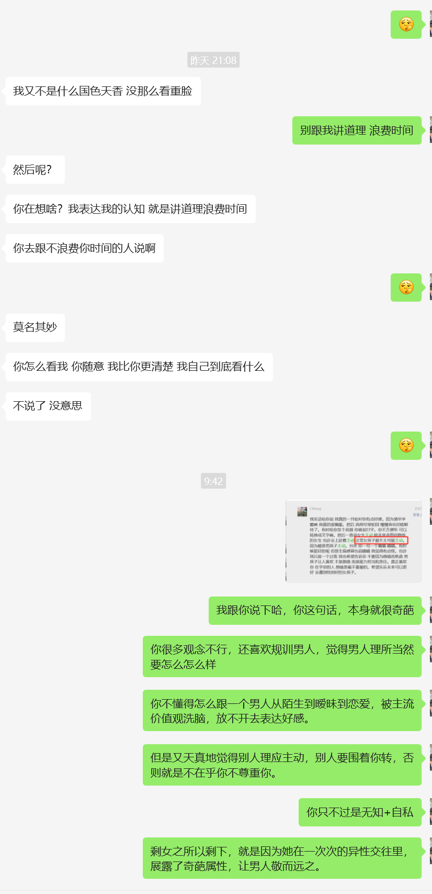

# 相亲女综述and筛选思路

其实大多数男女，都绕不开各种交友软件，探探这种约炮软件普通长相的人玩不了，而类似牵手、青藤这种软件，上面既有想单纯谈恋爱的，也有找结婚对象的，这里统称相亲软件。

长相一般的男的，玩相亲软件效率高一点（搭讪其实挺累的），包装人设只是第一步，后续还会有很多困难要克服。

笔者玩的相亲软件（2022年）：牵手app、marryU、青藤、她说、珍爱网、summer。

笔者身高173，颜值一般，自评5分，在相亲软件上，能最终跟我聊天有来有回的，大概率是4\~6分的妹子，偶尔有7分的。这里的7分指的是衣品+身材，综合起来比较带劲儿的。

本节内容，均是笔者玩了一段相亲软件之后的经验之谈，欢迎联系我探讨。

## 一切痛苦来源于帅哥vs美女的数量失衡

这个前文提过，我再强调一次。

女的一直在卷外在，男的一直被社会pua而不那么注重外在。势必造成美女多帅哥少。

女人20岁的时候月薪3000,40岁的时候月薪可能还是3000，她对此不会有什么心理负担，但是哦她多年攒的钱拿来做医美项目的时候可是一点都不吝啬。

很多女人能卷外在从17岁卷到40岁，男的呢？

这个帅哥美女的数量差值是巨大的，你想想，7亿女人都知道卷外在，7亿男的都不那么注意外在，这最终导致的帅哥美女的数量差值，可想而知。

但是社会财富增加，女人日子过得好了，能吃得饱饭租得起房子，为什么不找个好看点的男的谈恋爱呢？

你一年交税10W，她一年交税1w，但是哦，你们坐飞机高铁地铁都是一个价格，你们用的医保报销也是无差别，这给女人造成了一种错觉『我经济独立了，我想追求美好的爱情（跟帅哥打炮）』

你年薪50万，可是你不怎么好看，女人还是对你提不起兴趣，但是站在她的角度，总不能一直被帅哥短择吧？，帅哥连饭都不舍得请她吃，更别提带她旅游给她买礼物。(帅哥极度稀缺)

你牢记『一切痛苦来源于帅哥vs美女的数量失衡』这个真理，那么妹子对你各种态度行为，你都能合理解释了。

### 案例1

<figure><figcaption></figcaption></figure>

##

<figure><figcaption></figcaption></figure>

此女来自牵手app，年龄31岁，职业是大学老师。

别看女人说什么，女人普遍口是心非。

此女的真实想法是：

**因为看不上你的外在，所以对你特别理性，在鸡毛蒜皮的细节上，对你高要求。比如你没有及时回复、回复的某个话语她不满意。总之就是对你容忍度低。**

还有，如果一个女的跟你说男人外在不重要，她的真实想法是，她觉得你长得不咋地，与其花费精力金钱去卷外在，不如当好一个供养者。『你这个丑男，你还想变帅？你触犯我的利益了』

> 你变不变得成帅哥，未可知也，但是我肉眼可见的，我少了一个潜在供养者，我不爽了

虽然她看不上你的外在，但是她还是会跟你聊很多，邀约你，向你表露接触的意愿。

这是因为她微信列表里，她觉得分数达标的帅哥，那几个帅哥要么不怎么屌她，要么只愿意跟她约炮。

『跟王子打过炮，所以认为自己是公主』，她的榆木脑袋，导致她想不明白这个道理。

她只是凭着动物本能，指导自己的行为，对帅哥和非帅哥区别对待。

## 我在软件上的匹配情况

我吹自己北京成都有房，清华硕士，年薪50W。

外在方面，我173身高，不胖不瘦，路人颜值（脸型、鼻子都不好看）.

展示面，我拍的一些高档酒店、环境好的餐厅，尽量让外人看起来生活精致、家境好。

我看重女人身材，脸一般就行，但是我匹配到的身材火辣的妹子，还是屈指可数

这说明这个时代，稍微有点姿色的女人，都是把男人的颜值身高身材放在第一位的，这意味着，供养者更难泡妞了。比如说你长相5分男，那么你可能需要年薪100W，才能大量匹配到7分女，而且相处过程中还可能被女的百般刁难。

## 不妨把剩女标签化

把人标签化是为了我们更方便地生活，避免被傻逼浪费时间。

剩女之所以剩下，就是因为她在一次次的异性交往里，展露了奇葩属性，让男人敬而远之。

下面几个**相亲软件女的行为**，都是我微信的真实案例。

* 女1，33岁，来自marryU，身材火辣。加微信聊了几句，嫌我不够热情把我删了，我加回来，她说『你都不怎么跟我说话，白天你应该及时回复我』（其实是嫌我丑，所以对我容忍度低。她觉得我应该舔她，围着她转），还有微信一言不合就直接甩脸子，不赘言。
* 女2，32岁，来自牵手app。微信没聊几句，说不想干聊，想见面，即使是在我已经给她发我形象视频的情况下。（可能是不屑于跟我微信培养熟悉感，想见面看我实力，顺便广撒网）
*   女3，38岁，来自牵手app。初次见面我通勤过去她小区，位置是小区楼下茶馆，我到了她才懒洋洋步行过来，茶馆结束到付账时，我以为她理所当然付账的，毕竟她挑的地方我通勤找她。

    我故意在后面，她在前面，我就等着她付账。但是这女的扭个头对我说『来咱把账结了吧』。我就内心几头草泥马。

    后来微信聊天，我找机会说『咋了，要请哥哥吃饭嘛』，女的立马发飙，说我软饭男。（其实是嫌我丑，觉得我就该单向付出金钱）
* 女4--30岁、女5--27岁，来自牵手app。这两个案例，我没提前给她发我形象视频，女的也是微信上说不想聊天想见面，然后见了面然后跟我说她颜控。我都被气笑了，长啥样啊，就说自己颜控？有了这样的经历，我从交友软件转移到微信以后，一定会给女的发形象视频，打预防针，筛选。
* 女6--28岁。微信铺垫了一段时间，某一天我提出邀约，她说下班了比较累，让我找她，我当时坚持要距离折中。她开始发飙，说『因为是你约的我，所以当然是你来找我』
*   女8--27岁，来自青藤。

    * 1.略有姿色，骨架大。
    * 2.聊天直女，但是真诚，对我有窗口。
    * 3.见面后表现尚可，分别时我要求拥抱，被拒绝
    * 4.回家后主动给我打语音，之后微信断断续续聊天，但是直女不会表达好感，所以也就到不了暧昧
    * 5 若干天后，说我们不合适，指责我不够主动

    总结，奇葩女，不懂得怎么跟一个男人从陌生到暧昧到恋爱，被主流价值观洗脑，放不开去表达好感。 但是又天真地觉得别人理应主动，否则就是不在乎自己。 而且 还比较自信，喜欢规训男人。

## 宇宙级难题

对我而言，每个相亲软件/交友app上面的妹子，都能简单归结成下述问题

1. 已知对方姿色一般但不丑，自称恋爱经历不多，但是背地里可能被帅哥短择n次。
2. 对方对你有一定窗口
3. 对方对恋爱可能有各种奇葩的诉求，不按常理出牌，脑回路让人费解。
4. 你约她能约出来

已知上述几条，现在，我们如何在花费最少的时间+金钱的情况下，把对方睡了/长期打炮/筛选出比较有戏的妹子。

一想到要不停跟奇葩过招，随时面对时间精力的白白损耗，就比较焦虑

## 相亲女的极端情况

_**极端差的情况：**_

1. 我长得挺不错的，但是探探上那些帅哥都不怎么搭理我，或者只跟我打炮，我来玩相亲软件找个经济适用男，应该能降维打击吧
2. 我比较慢热，他得主动点，起码请我10顿饭，带我旅旅游吧
3. 每次见面，男的通勤20km来我这边找我，请我吃饭，理所应该的。
4. 广撒网是正常的，得见100个男的，挑选对我最好的最舍得花钱的（颜值身高必须过关），重点培养。反正每次面基我又不用花钱
5. 我是女孩子，男方最好像保姆一样哄着我，顺着我。

## 相亲女的分类

我只以我自己的长相为参考基线来讨论

*   类别1：跟我分数一样的。

    这种又分两类，眼光高的和眼光低的，眼光高的需要你价值硬或者肯花钱的，不建议接触。

    眼光低的是我的目标，这种妹子需要走心，而且花的钱也不用很多
*   类别2：比我分数高的。

    这种其实没有一个是容易搞的，参考一下 [#nv-ren-dui-gong-yang-zhe-de-san-zhong-tai-du](../yi-ge-can-ku-de-shi-shi/sub1.md#nv-ren-dui-gong-yang-zhe-de-san-zhong-tai-du "mention") 里面的内容，

## 相亲女没怎么聊就主动邀约你？

指的是初次见面。

这里的『没怎么聊』，指的是『聊天没几句』或者『聊天只是断断续续的唠家常』

这个问题非常头痛，因为**女人的时间是不值钱的**。

跟一个不靠谱的相亲女 微信聊天2小时，见面前收拾1小时，通勤+见面1小时，这4个小时拿来干啥不好呢。

但是这个问题又十分关键，因为我们要避免傻逼浪费我们宝贵的时间。

『女方随意邀约』我遇到很多，这种女的连聊天+调情的时间都不愿意花费，非坏即蠢。

我都被搞的有心理阴影了，见面了才发现对面是傻逼，心疼自己浪费了很多时间。

1.  坏：单纯广撒网的，pass掉。

2.  蠢：那么她未必坏，可能只是经历少而已，你可以见她。但是要低成本。

    参考 [#dui-xiang-qin-nv-de-shai-xuan-si-lu](guan-yu-xiang-qin-nv.md#dui-xiang-qin-nv-de-shai-xuan-si-lu "mention")

### 解读女人的广撒网心态

20240105某网友发言：

> 我告诉你为什么，因为一个女生能够一天见一个，一个礼拜见5个男的
>
> 他们见面并没有我们想那样要慎重，很喜欢才见面
>
> 他们见面就跟。健身房办卡一样，随便拉一个人就会游泳健身了解一下

在这里我会比较啰嗦，因为我发现，对每个人来讲，很多简洁的道理，需要被现实教育得头破血流，才会真的当回事，从而指导自己的生活。比如低调、谨慎，比如身体健康才是第一位的，比如不跟人争论，比如认识到人就是分三六九等的，比如『唯女子与小人难养也』。

所以我把一个简单的结论掰开了揉碎，反复地强调，又是举例说明，又是讲一些很通用的道理去佐证这个泡妞技巧，就是为了让你上心。

我不希望读者跟我一样约会了好多相亲女才意识到哎呀好像不对劲儿，我希望你看完我的文字，花费更少的时间精力实战完，又跑到这里看我写的文字，然后一拍大腿说原来我跟作者是有共鸣的，谢谢作者让我少走弯路了。

接下来我需要你上心的一句结论是：**女人喜欢广撒网而男人不喜欢广撒网。**



贴一个知乎链接，上面很多男性回答在阐述女人的广撒网问题。你可以去找找共鸣。

摘录一个回答里面的内容：

> 女性的择偶策略是通过大范围的接触异性，建立自己的mating list，然后在里面筛选一个综合价值最高的。简单来讲就是大范围的养备胎，然后挑一个最优秀的，有相亲经验的应该都明白，没几个女生相亲只相一个。

意识到男女思维的差异非常重要。

男人想的是：我天天饥渴的难受，这女的有点姿色，我不介意跟她打个炮，见面就要牵手拥抱接吻，最好直接开房。

女的想的是：

> 我这么仙气飘飘可得好好挑选一下，虽然我只有5分，但是我跟7分男打过炮，并且只要我肯努力广撒网，我仍然时不时能约到一个7分男打炮。
>
> 打过炮=我配的上他。
>
> 所以在我眼里，低于7分的男的，我其实是看不上的，但是我又不能一直单着，所以我才需要广撒网，找到一个我满意的长期交往。

这在男人看来似乎很难以理解，很不理性，但现实就是如此，千万不要以己度人。

这一节花费大量篇幅阐述对相亲女的筛选，就是在告诉你，我们要尽量把这种女的筛选掉。

比如你长相5分，我希望你约会过几个3分丑女，然后又被丑女贬低外在，被丑女挑小毛病，然后被丑女拒绝，再回来看这些文字。

***

**原因一：女人广撒网是因为**<mark style="color:red;">**觉得很多男的配不上她**</mark>

如前文所言，为什么5分女执着于搞7分男，**想不明白没关系，你实战几次，复盘总结一下，然后把这个结论当数学定理记下就行了。**

可能是小仙女的理性思维缺失，导致她单纯地认不清自己、贪婪而无脑。

也可能是幕强。

也可能是女性怀胎十月的风险让她有着『谨慎挑选伴侣』的天然习惯。

也可能是社会舆论导向让女人觉得广撒网是理直气壮的。

你只需要记住，这是现实，就行。

**原因二：女人广撒网是因为成本低**

因为不用承担见面喝咖啡的开销，并且很多女人没有珍惜时间的观念，这使得『女方随意邀约男的见面』对于女人看来是稳赚不赔的操作。

她吃准了你不好意思提出AA，并且如果你答应了去她住的附近见她，那么你付出了通勤+约会开销，她只是懒洋洋地下楼走两步见你，她还达到了低成本广撒网的目的。

说不定还能混顿饭，何乐而不为？

***

现在我们回到之前那个问题，她为什么没聊几句就随意邀约你见面？

因为本来就抱着『你这男的长相离我的理想型有差距，我见面看看你整体感觉』的心态，所以不屑于跟你聊天+暧昧+表达好感。

> 而且，她之所以随意邀约你见面，还因为她这样搞过很多次，那么多饥渴的男人，她大概率从这个方式占过很多便宜，比如排解了无聊的时间、不用花钱还看了电影、吃了大餐

她想广撒网，那么她就没理由投入情绪聊天，低成本原则，人的本性嘛。

内心活动是：我对男人的相貌、财力、跪舔程度都有要求，这个男的，我真的懒得跟他认真聊天，先见见真人再说。

对你没有感情，见面是为了 **白嫖约会花销+让你通勤找她+看你经济实力+看看你真人外貌**， 她为了达到她『筛选供养者』的目的而这样做，而她自己，可能连通勤成本都不愿意付出。

1. 看看你真人外貌：既然广撒网，那么男的要过颜值关。反正打定主意了要见几百个男的呢。谈恋爱不是小事，虽然遇到高分男我会随时献出自己的身体，但是在我眼里，大多数男的只配当供养者。
2. 白嫖约会花销：她没付出，何乐不为（男的不好意思提AA）。 你试试说『咋了，想请哥哥吃饭嘛』，她可能就不爽了把你删了。
3. 让你通勤： 她可能直接说去她家附近的地点。你试试说『来我这边坐坐呗，我家附近有家店环境很好。』，然后她可能就说你没诚意把你删了。
4. 看你经济实力：她想看看你开什么车去见她。
5. 看你供养意愿是否强烈：见面时是不是请她吃大餐(美其名曰：男人的诚意)。

这种相亲女对软件上条件好的男性，都会随意邀约，见10个20个男的，挑选最高价值、最舔狗（供养意愿强烈）的几个慢慢接触，抱着做生意的心态，又有什么感情可言呢？

说白了就是相亲女自己利益最大化，极度自私。

跟我们单纯想打炮的目的相违背。

这种女的说实话比较难搞，除非你价值很高（开好车+住房好+真人比照片还好看）。

千万不要赴约：

> 如果你随便聊了几句，她提出见面，你傻了吧唧赴约了，那么你们俩见面后，大概率是两个陌生人在那唠家常：你听她讲述她的失败恋情，家庭条件，工作。你们没有任何激发荷尔蒙的行为，而且你大概率会被对面相亲女的各种奇葩三观震惊到（女权、小仙女思维、不解风情(对你不解风情罢了)）。
>
> **赴约结束后，你成为她相亲记事本上的一行记录**（比如：2023年8月第10号，代表她本月见的第10个男的），他拿你跟之前的男的对比来对比去，**你对她没有任何特别之处，因为她没有对你投入什么（无通勤、无约会开销、无聊天情绪投入）。**
>
> 而且后续你微信上找她聊天，她可能会跟你说『我们不合适，适合做朋友』，她不会告诉你真实原因，欲加之罪，何患无辞，随便挑你一个毛病，比如说不喜欢穿牛仔裤的男的。
>
> 真实原因就是嫌你丑或者没钱或者不够跪舔。

### 她随便邀约你，同时还规训你

这一点比较可恶，她骗你也是在骗她自己，可能她意识不到，所以又回到之前说的那个道理：女人是非理性的。

好多次相亲女微信上说不想聊天想直接见面，我拒绝，说聊聊再见呢，这时候女人开始规训我了：

『光微信聊天那不就是网恋吗』

『好感得实际接触才能培养呢』

『我是真心找对象的，不喜欢瞎聊』

『我比较慢热，微信上放不开』

『我主要不知道聊什么』

『虽然你给我发你的形象视频了，但我还是觉得见真人感觉比较真实』

其实吧，这种类似的话，当放屁就行。接触女的多了你就会发现，跟女人理论真是浪费生命。

话语可以骗人，但是行动不会骗人。分享一个案例

还有一种更可恶，是女的对你假性感兴趣，随便说几句表达好感的话，就是为了很容易地约你出来。这种假性的好感其实微信聊天看得出来。

> 笔者遇到过一次，跟我大胆暧昧的，见了面却向我请教我讨论职场发展的，那意思是把我当人脉了（看我人设牛逼，生存价值高）。我心想你这蠢货学历没有、能力没有，跟我处人脉你配吗？
>
> 我说我觉得你微信聊天挺主动的，这种用心的女孩子很不错。她说不说点骚话咋约你出来呢，我？？？？

### 如何应对相亲女的随意邀约(初次见面)

核心原则是斗而不破。

可以表达真诚，然后发几个灵魂拷问，强筛选掉太奇葩的：

> 1. 我给你发我的形象视频哦，防止你是颜控类型的，
>    1. 我有一点抬头纹 太阳穴那里还有点痘坑；
>    2. 不浪费彼此时间\~我们抽空打个视频
>    3. 我是为了防止你对颜值有执念，所以披露足够信息 也是为了不浪费彼此时间 (其实我是怕你傻逼，浪费我时间)
>    4. 主要是软件上我遇到很多直接约见面的，然后其实是广撒网的，就被养鱼；
> 2. 我不特别想见面，我喜欢聊天培养熟悉感再见面呢；但是担心没有铺垫 见面了不好升温
> 3. 聊天不用心的 见面相处也大概率不会用心呢
> 4. 你如果是那种广撒网的女孩子，我们可以互删了，我想被坚定地选择呢； 我如果接触一个女孩子，就专心只跟她接触
> 5. 我真的没空跟广撒网的女的周旋，彼此看对眼的，都是聊天积极，并且愿意积极推进关系
> 6. 哈哈 你要是想着广撒网找舔狗培养  那我们不用聊了，我喜欢双向奔赴的关系
> 7. 我希望是因为有基础的好感才见面，而不是女的广撒网随便约我

也可以不跟她掰扯所谓的真诚话语，强行用话术筛选：

**这么着急想见面嘛，准备请我吃什么？**(你发店铺位置哦，路边摊我可不去)

**来我家附近呗，请我吃个饭**。（斗而不破）

> 你这么随便邀约我，可以啊。
>
> 我也可以不聊几句就见面，前提对方要消费。
>
> 或者你来我家楼下走走路也行啊。
>
> 你对我需求这么大，这么急着见我，那你就要付出成本。
>
> 人家可是矜持的男孩子，要保护好自己呢
>
> 这么着急见我，说吧，想请我吃什么。（走她的路，让她无路可走）
>
> 我知道你心里的小九九，现在我让你花钱请我消费，你还肯不肯见我？

男神心态：我可是高价值男人，**我的时间这么宝贵**，花费时间和你见面就是已经让你占了大便宜了，你花点钱很正常，不花钱岂不是我很随便。

如果你实在闲得无聊想见面，那就抱着无所谓的心态，约她逛公园，或者小河边走走。具体的参考后续文章。

## 对相亲女的筛选思路 

### 理想情况

1. 匹配完，聊若干句能切入轻度暧昧调情的，再加微信。（有的女的觉得一上来就加微信是在占她便宜）
2. **提前发自己的形象视频,并且跟她打视频**。并且要说清楚自己颜值有什么瑕疵。防止对面是照骗，或者对面看不上你的颜值（有的相亲女，只是蠢而已，虽然她丑，但是她颜控，这种有很多）
   * 看不上颜值就没必要见面，我们可以哪天打个微信视频
3. 加了微信，能聊一下基本信息+分享日常延伸话题+爱情观+走心+互相表达好感+继续暧昧，再邀约
4. 能接受去你指定地点的，再赴约。如果她说太累想让你找她，那么她必须答应『**我可以去找你，但是你要招待我哦/请我喝咖啡哦**』(笔者遇到过小胖妹说自己好累，装可怜让我心软，我通勤过去，她说她单身好多年了，而且颜控，而且她也明确说了『单身这么久可能是我自己的原因』)
5. 见面之后，语言调情+互相表达好感+拥抱接吻

### 不理想情况

对付不理想情况，说实话我也不知道咋办，这种女的要么是经验少不会沟通，要么就是广撒网找供养者。

不按常理出牌，意味着，她说的话、表现出的行为，你要是认真分析，会把你自己都搞懵了：这女的到底对我有没有窗口啊？这蠢逼脑子里究竟在想什么？。

* 比如她加了你微信，你跟她聊天，她说她觉得聊天没意思，不如见面。那么她内心的真实想法呢？我们无从知晓。
  * 她不跟我们暧昧聊天，可能她觉得你不配跟她暧昧调情(她只是靠**本能**驱使)。
  * 可能是单纯广撒网(帅的和肯供养的都想要)
  * 可能是觉得实际见面比较踏实（女方觉得必须看真人顺眼了才能继续接触）
  * 也可能是她真的对你很有兴趣，但是她不知道怎么跟男的打交道。（再次强调，女人的时间是不宝贵的）
* 她可能跟你微信聊了几百句，综合花费了好几个小时了，但是却一直干巴巴的，毫无暧昧调情。
* 见了面，这种女的大概率是不会言语升高+肢体升高的，那么就需要我们男的主动。
* 面谈时，女的可能只会唠家常，因为别的她不会。她可能只会跟你聊工作、学校经历、爱好等等，我试过进行语言升高，比如说『哎呀，你脸颊红扑扑的，挺可爱的』，这时候，如果是比较会的女的，会说『你夸我，我都小鹿乱撞了』，但是不会的女的，可能就说『谢谢』或者『很多人都这么夸我』，这种回答就比较让人下头，因为她不会调情。
  * 我还遇到过，见了面，跟我聊哎呀我的朋友一周见好几个男的，或者问我说你最近见了几个妹子，我心想你是傻逼吗，你跟我说这种事想表达什么？然后对方接下来也承认了自己想到什么就说什么，因为不会找话题（漫无目的罢了）
  * 我还遇到过，面谈时口头夸我帅的，但是散步时我碰了她肩膀一下，她就立马表现反感，说还不熟的。
* 面谈时，如果女的只会唠家常，那表明这个女的不会表达好感，她内心可能对我有兴趣，但是她外在表露的蛛丝马迹让人云里雾里，无法准确判断。
  * 她可能有各种奇葩观念，比如觉得男的就该无原则地主动、男女就多聊天多约会就自然而然成情侣了。这意味着，我跟这个女的大概率会进入拉锯战，比如约会十次八次，她来一句我慢热，这跟我们高效率把妹的原则相违背。

### 针对不理想情况的解题思路：

『加了微信以后，聊天时不跟我表达好感暧昧调情，但是愿意跟我唠家常，并且非得约我见面』

我见了几个这种女的之后，得出结论：见**这种女的，大概率浪费时间**

而且这种女的还分两类：

> 一类是见过我一面后，不联系的，这种反而相对靠谱，没有浪费太多咱们的时间，人家对男人外貌和财力有要求，可以理解。
>
> 二类是见过我一面了，还跟我联系，维持一定程度的主动，她会说不喜欢聊天，喜欢见面接触，但是聊天和见面都没有暧昧调情，这种女的说实话更可恶。
>
> 当然了，你多遇到几个，习惯以后，就不会跟这种傻逼周旋了。
>
> 贴一个案例，比较典型
>
> [#an-li-er-sui-yi-yao-yue-wo-de-35-sui-da-ling-nv](dian-xing-xiang-qin-nv-an-li.md#an-li-er-sui-yi-yao-yue-wo-de-35-sui-da-ling-nv "mention")

**所以我认为，这种女的，对我们来说优先级很低，你实在无聊了，可以低成本见她，要不然，还是优先见列表里愿意暧昧的妹子。**

1. 如果女的微信聊天不暧昧，但是又似乎对我们有一定窗口，而且你最近刚好无聊，那就大胆约她
   1. 低成本原则，比如**压马路逛公园**。
   2. 也可以下班了顺便见一面，见了面你就说\*\*『哎呀，今天见面主要是让你看看真人』。然后跟她唠嗑大概5分钟我们就结束\*\*
   3. 分享一个判断对方的兴趣指标的话术：你问她『今天见到我开不开心呀』，她如果说『一般般吧』，那么可以断定这女的对咱兴趣不大。如果她说『很开心』，那么咱继续问几个暧昧试探，比如『你也不夸夸我，互夸增加好感度』这种，如果好几个问题，她的接茬如果都不让我们满意，那可以考虑结束约会。具体话术参考 [san-yue-hui-pian.md](../san-yue-hui-pian.md "mention")
2. 压马路逛公园or喝咖啡，聊几句，判断女的只会唠家常，不接茬你的暧昧试探，跟个傻逼一样说话漫无目的(大概率的，因为她微信就是这么跟你聊的)，那么5分钟我们就考虑结束约会。为什么呢？因为没有情绪波动的聊天，对于增进关系毫无意义
   1. 因为对方是傻逼，所以我们言语升高是做不了的，那么跳过言语升高去肢体进挪，失败的概率很高，又或者，对方单纯看不上我们的外在（你见光死了）。
   2. 你也可以大胆进挪，比如摸手，拥抱，进而约家里。如果被拒绝就结束约会。(不建议)
3. 初次见面各回各家后，女的要么微信继续对我们暴露窗口，要么变路人不再联系。
4. 如果女的仍然有窗口，那么不要跟她微信聊太多，这种傻逼聊天不会暧昧调情，聊多了她还会挑你毛病，规训你。（比如说你不主动、指责你某个观念不正确）那么我们干脆不聊。（况且，跟傻逼聊天也是浪费时间）
5. 打直球儿，她直，咱就比她更直。
   * 哎呀你这人挺好的，哎呀我对你有好感哦，哎呀你是我喜欢的类型 你对我感觉怎么样，哎呀我们要多约会接触下。
   * 别跟我聊微信了，我不喜欢干聊，要多跟我约会哦
   * 你知道美国的dating文化嘛，就是恋爱前的试用期，两个人正常约会，从陌生到熟悉到暧昧，跟着感觉走，看看能到哪一步。
   * 等我们都觉得很喜欢对方了，那就正式确认关系。
   * 哎呀我想看到你的付出呢，**你请我吃个饭呗**
   * 哎呀人家今天加班好累，你来找我好不好，体谅一下哥哥

### 一定记得发形象视频and打视频：

笔者自评长相5分，我对自己适配什么分数的妹子是心里有底的，但是**防不胜防的是，小仙女的内心想法的不可控**。持广撒网择偶策略的女性是普遍存在的，我们要努力识别出容易搞定的妹子去接触。

愿不愿意跟你暧昧聊天，能筛选掉一部分女的。

男方发形象视频+打视频聊天看脸，坦白说明自己脸上哪里有缺点，能筛选掉一部分女的。

第一次见面前的通勤距离、约会场所的拉扯，还能筛选掉一部分女的。

即使已经考虑完备地筛选，到了最后见完面，**还是可能会翻车**，因为我们无法预料一个人内心的真实想法，她也肯定不会直白地告诉你为什么看不上你。

又或者，见过面了，你觉得是翻车，在女人看来，这只是很正常的见面聊聊交个朋友。

就算是长的非常不咋滴的女的，也可能要求很高，这没办法，见女的多了你会发现这是一种常态。而且被丑女随便挑毛病拒绝『我们不合适呢』，经历过一次你就会知道有多么难受，就跟吃了屎一样：

> 惊愕于她的丑而不自知，她的丑还广撒网，懊悔自己跟一个愚蠢仙女做了无效社交
>
> 核心原因是：
>
> * 女性思维下，女的觉得睡到了帅哥，就是配的上，不管玩玩还是认真的
> * 所以她看不上你，跟她丑不丑没关系

所以才说泡妞是个low活，我们能做的就是尽量做好前期筛选工作。

### 永远不会出错的筛选办法

笔者在约见过大概<mark style="color:red;">**50**</mark>个相亲软件上的妹子以后，得出结论：

_**如果你想避免被广撒网、被丑女随意拒绝、跟愚蠢小仙女无效社交，百分百稳妥的方法是，初次见面只花费5分钟，然后你就找借口开溜。**_

跟搭讪不同，搭讪加的微信，妹子要么是礼貌给你微信，要么是认可你的外在给你微信，在此基础上聊天暧昧完，不会出现正式约见时，现场妹子矜持冷淡的

### 可以考虑要求AA消费

这个效果因人而异，你可以见面之前要求AA消费（有被删好友的风险）。

如果见面各回各家以后，妹子微信上拒绝你了，说『我们可以做朋友鸭』，你可以要求她aa饭钱/咖啡钱。毕竟咱们已经用心聊天+发形象视频+明说反感广撒网的女的，她还是想着占便宜养鱼，那就不能惯着她了，咱们的时间如此宝贵，却被小仙女这样不珍惜（蠢or坏），有必要讨回损失，顺便恶心一下她。

## 不妨圆滑一点

先贴一个来自知乎的发言：

> 提问：6个虾，男朋友直接吃了1个，你们觉得过分吗？
>
> 某回答：
>
> 作者：Home Talk\
> 链接：https://www.zhihu.com/question/641839715/answer/3385606700\\
>
> 有的人谈恋爱是有剧本的，你跟这种人谈恋爱像玩剧本杀一样，走错一步就要被淘汰。
>
> 比如题主的剧本可能是这样的：
>
> 你想吃虾，男朋友毫不犹豫的点了六个，虾一上桌，他就娴熟的拨开虾壳，取出完整的虾肉，整套动作一气呵成。
>
> 你沉着脸看着他，心想：这么贵的虾，都不跟我说一下，自己就剥了吃了？
>
> 下一秒，他把虾肉蘸了一点酱汁后，并没有自己吃，而是轻轻的送到你的嘴里。
>
> 你嚼着鲜甜弹牙的虾肉，感受到了他无微不至的爱。
>
> 这还没有完，接着是第二个，第三个，第四个，第五个，第六个。
>
> 不知不觉，你自己吃光了一盘虾，突然意识到，男朋友还一个都没吃呢。
>
> “可是你自己还没吃呀？”你羞涩的对男朋友说。
>
> “我喜欢吃虾头和虾壳，里面富含[氨糖](https://www.zhihu.com/search?q=%E6%B0%A8%E7%B3%96\&search\_source=Entity\&hybrid\_search\_source=Entity\&hybrid\_search\_extra=%7B%22sourceType%22%3A%22answer%22%2C%22sourceId%22%3A%223385606700%22%7D)，可以强健体魄，这样才能更好的保护你呀！”
>
> 你幸福的笑了，但你的脑海里又突然冒出了一个不好的念头，不禁问道，“你对前女友也这么好吗？”
>
> “别的女人怎么能跟你享受同样的待遇呢？我的公主，你是第一个，也是唯一一个，让我肯为她剥虾吃的人。”
>
> 你十分欣慰，又痴痴的笑了，突然，你脸色一变，觉得哪里不对劲儿，立刻严肃的对他说：“那你刚才的技术为什么那么熟练，一气呵成，难道不是因为以前经常帮前女友剥虾吗？”
>
> 男朋友马上解释道，“那是因为我为了让你开心，买了十斤虾，每天对着镜子练的。”
>
> 你终于被他感动了，然而好事多磨，买单的时候，他的卡出了点问题，让你先垫付300元，回头再转给你。
>
> 那天夜里，你失眠了，辗转反侧，终于想明白哪里不对劲儿了——他之所以一个虾都没吃，又让自己垫付餐费，原来就是因为嫌贵，不想花钱，如果我管他要钱，他就会跟我说，虾都是你一个人吃的，凭什么让我付钱啊？
>
> 现在想想，那个虾也没那么好吃，而且太贵了。
>
> 第二天一早，你刚要去和男友提分手，就收到转账信息，是男朋友转给你的300块。
>
> 你如释重负，原来真是自己想多了。
>
> 等等，一个念头闪过，你再次陷入了忧伤，为什么他给我转的是正正好好的300元？男女朋友之间要不要算得这么精确？他如果给我转500或者转1000这样的整数，我都不会多想，他却一分不多，一分不少，刚好给我转300，他终究他还是没把我当成自家人。
>
> 这这场虚拟设定中，男朋友作为王者玩家也只通过了三关，无缘进入总决赛。
>
> 但题中的男朋友的实际表现，是开场就犯规出局，实在太菜了！
>
> 什么身份？也配独享一只虾？我们支持题主赶紧把他淘汰了，他实在配不上你尊贵的身份和活跃的思维。

针对这个吃虾的故事，我想说的是，女人的傻逼程度是未知的，我们要变得圆滑，尽量先把简单的关卡过了。当然了，我们的原则是口头上让她爽，但是绝不会无脑付出。

女人说到底还是**看心情**，笔者最近反思翻车经验，比较重要的一点就是嘴要甜，要顺着她，在鸡毛蒜皮的地方，把她哄开心就行：顺着她的价值观。

不是说你圆滑就能日到她，打个比方：**你想赢牌局，前提是你还在牌桌上，而不是一把梭哈输个底掉**。

* 比如女的说**不喜欢目的性强的**，那我就老老实实直白表达好感、走心路线。因为真的有几次，是因为妹子觉得我太老练，。。就翻车了。
* 比如女的觉得初次见面**唠家常也挺好**，OK，我们见了面唠几句，然后借口说朋友电话找我有急事开溜。她也不能说你什么，起码我们还有机会后续操作她。
* 对待恋爱的态度：某次翻车一个7分女，就是微信聊到『我不喜欢唠家常』，她觉得我对男女交往**太理性太程序化，她心里不爽了**，她觉得男女唠家常就自然而然成为男女朋友了。我要是顺从她的观念，可能就不会翻车了，起码当前这一关能过。
* 女人不想聊天想见面？某一次，相亲女说不喜欢聊天想见面，我就说见面可以，但是路途要折中，消费AA，然后妹子就把我删了，说到底还是妹子不爽了。

## 微信暧昧了，你别丧失理智

微信暧昧了，见面也可能翻车。

有的相亲女伪装很好，跟你聊暧昧，假性IOI，其实只是身经百战的她，随口说出的撩人话。

你丑就是原罪，别以为聊得暧昧了你就稳了，见面了聊几句，判断对方是傻逼，果断闪人，别浪费时间。

微信暧昧了，你可别傻了吧唧以为遇到真爱，以为对方被你魅力折服；

见面翻车要么是你太丑，要么是你经济实力让妹子怀疑。相亲女可能对一个穷帅哥恋恋不舍，但绝不会对一个包装人设的丑男恋恋不舍。

保持理智，不要单向通勤、不要请吃饭，时刻谨记平衡彼此的付出。
